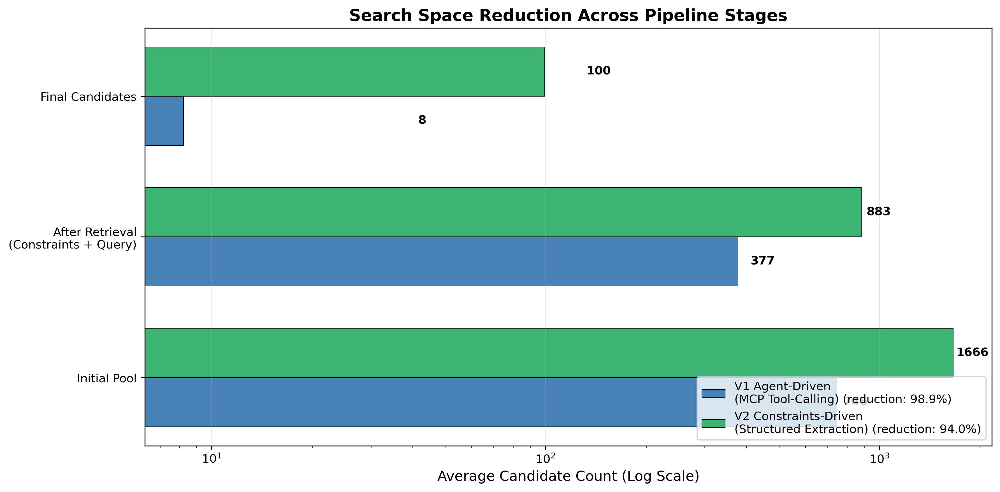
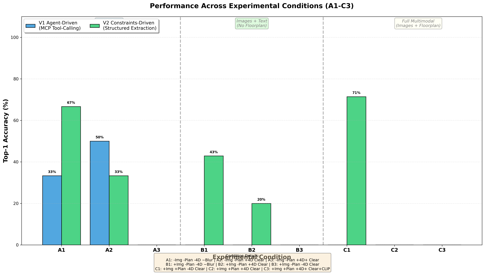
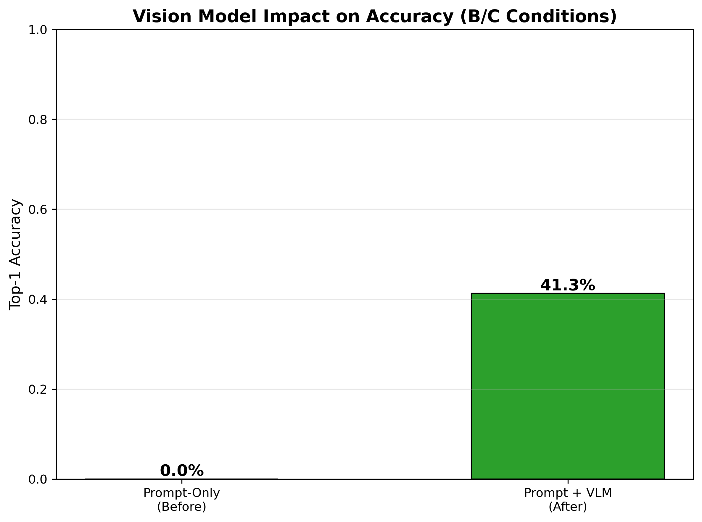
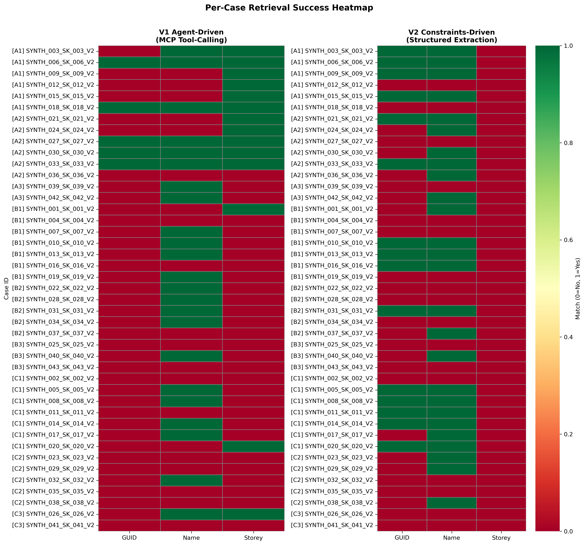
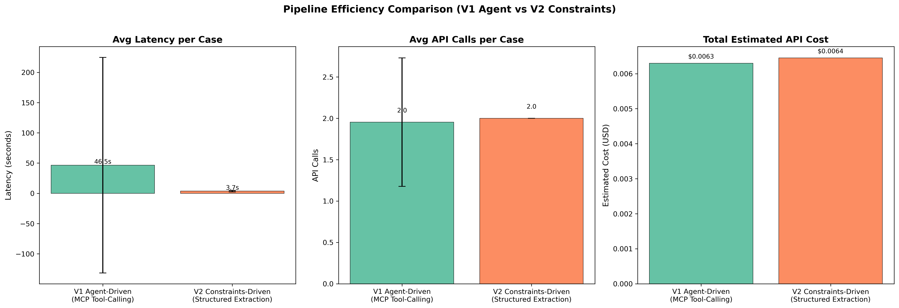
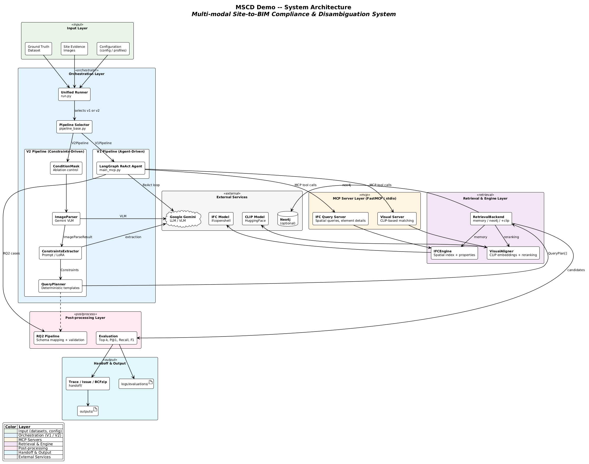
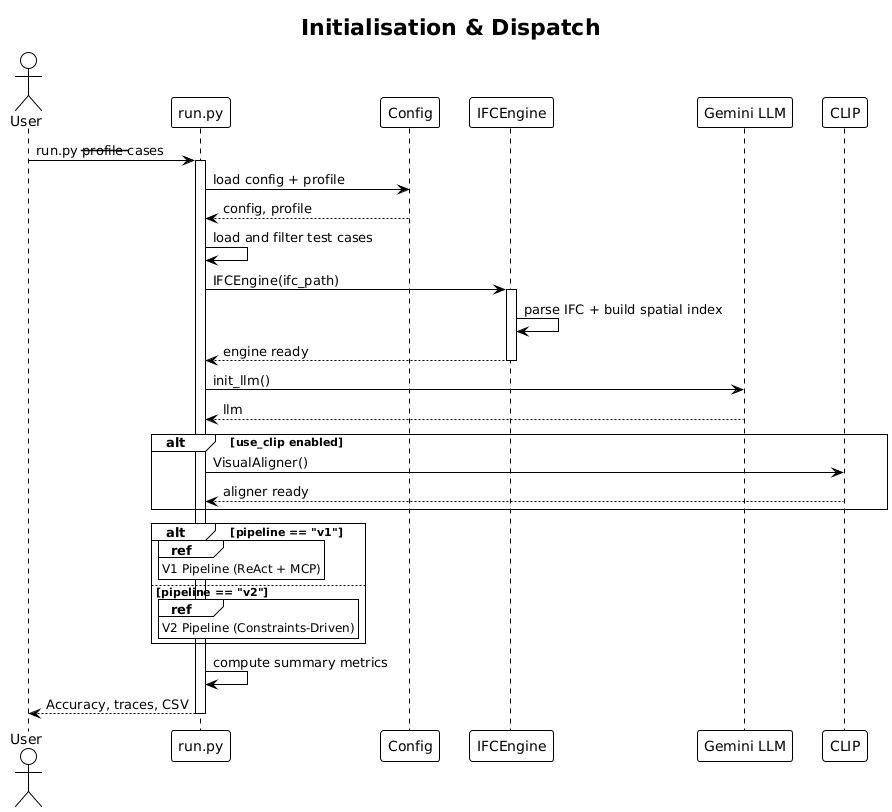
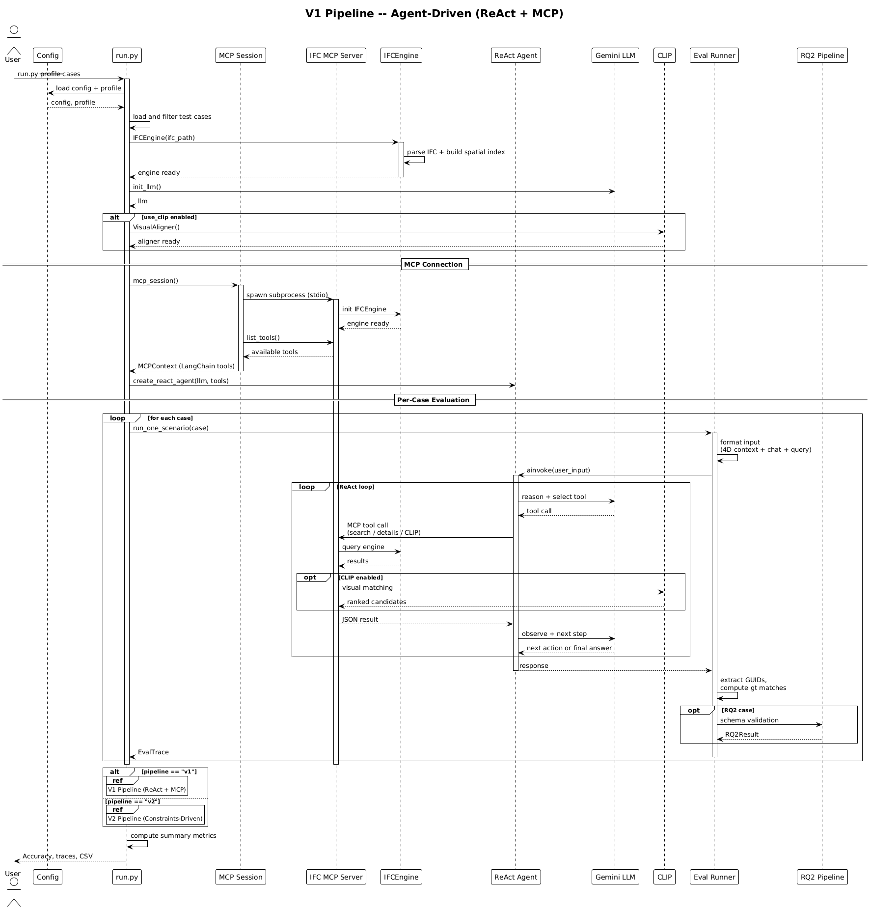
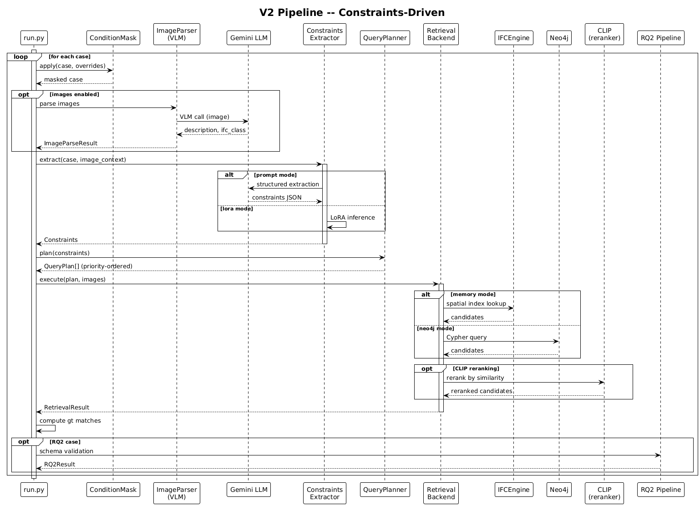

# Log

> Date: Feb 2026
0. Dataset, 
1. V1 to V2, 
2. Experiments result
3. Next Steps
4. Diagrams

---

## 0. Dataset curation:
### 0.1 Dataset Structure
- **inputs.chat_history**: Simulated chat messages (e.g., "Crack on the slab surface, need assessment").
- **inputs.project_context**: Metadata (timestamp, sender_role, project_phase, 4d_task_status).
- **inputs.images**: Relative path to site photo (e.g., `datasets/synth_v0.2/cases/imgs/img_SYNTH_001_SK_001_V2.png`).
- **inputs.floorplan_patch**: Relative path to floorplan (e.g., `datasets/synth_v0.2/cases/plans/plan_SYNTH_001_SK_001_V2.png`).
- **query_text**: The user's specific question (e.g., "What's the spec for this?").
- **ground_truth**: The correct IFC element (target_guid, target_name, target_storey).
- **bench.condition**: The "home" condition of this case (e.g., B1).

### 0.2 Experimental Conditions
The same 43 cases are evaluated under 9 distinct conditions (A1–C3). The `ConditionMask` selectively strips modalities to test system robustness:

| Group | Images | Floorplan | Chat Blur | 4D Metadata | Purpose |
| :--- | :--- | :--- | :--- | :--- | :--- |
| **A (A1-A3)** | Removed | Removed | Varies | Varies | Text-only baseline |
| **B (B1-B3)** | Kept | Removed | Varies | Varies | Vision-driven (site photos only) |
| **C (C1-C3)** | Varies | Kept | Varies | Varies | Full multimodal (floorplan + optional images) |

<!-- 
| Condition | Chat | Images | Floorplan | 4D Metadata | CLIP Rerank |
|-----------|------|--------|-----------|-------------|-------------|
| **A1** | clear | no | no | yes | no |
| **A2** | blurred | no | no | yes | no |
| **A3** | blurred | no | no | yes | no |
| **B1** | blurred | yes | no | no | no |
| **B2** | blurred | yes | no | no | yes |
| **B3** | clear | yes | no | no | no |
| **C1** | clear | no | yes | no | no |
| **C2** | blurred | yes | yes | no | no |
| **C3** | clear | yes | yes | yes | no | -->

**Example Logic:**
- **Condition A1**: chat text + metadata; images and floorplans are stripped.
- **Condition B1**: Images are kept; floorplan is removed; chat is blurred.
- **Condition C3**: All modalities (text, metadata, images, floorplan) are available.


## 1. Experiment Evaluation

### 1.1 Dataset Issues and Mitigations

**Issue 1: Instance Disambiguation is Physically Unsolvable, Top-1 as the Primary Metric is Misleading**

Even under the best condition (A1: clear text + 4D metadata), Top-1 accuracy is only 50%. This is not a system failure but a fundamental physical limitation. When three identical windows sit side by side on the same floor, no amount of textual or visual context can distinguish them without a unique identifier (e.g., a QR code or serial number). Top-1 accuracy is therefore an unfair metric for this class of problems.

A system that correctly narrows 1,666 elements down to 3 candidates — but picks the wrong one of the three — is far more useful than one that returns all 1,666.

**Mitigation: Metric Pivot**

Reframe the evaluation around two metrics that better capture practical value:

- **Search Space Reduction (SSR):** How much the candidate pool shrinks (e.g., 1,666 → 5 elements = 99.7% reduction).
- **Top-K Recall:** Whether the correct element appears anywhere in the top-K candidates.


### 1.2 Agent low accuracy -> Constraint query (RQ2) : V1 to V2 Workflow Comparison

The core shift in this architecture is a transition of power: moving control from the **AI’s "vibe" (V1)** to the **System’s "logic" (V2)**. Think of it as moving from an intern who "figures it out as they go" to a specialized clerk who fills out a strict form for a senior engineer.


| Feature | V1: Agent-Driven (The "Black Box") | V2: Constraints-Driven (The "Glass Box") |
| --- | --- | --- |
| **Core Logic** | "Figure it out yourself." | "Fill in this form; the code handles the rest." |
| **Path** | Iterative ReAct Loop (1-5 steps) | Linear Neuro-Symbolic Pipeline (1 step) |
| **Reliability** | Variable (Probabilistic/Stochastic) | **High (Deterministic)** |
| **Query Method** | AI writes and runs its own tools | **Python generates a strict Cypher query** |
| **Best For** | Creative brainstorming, general tasks | Engineering, compliance, and safety |


V2 treats the LLM as a **translator**, not a decision-maker. It forces all unstructured data through a "funnel" to ensure the output is safe for a database.

1. **Input (Unstructured):** Vague chat ("Look at this"), images, and 4D metadata.
2. **Middle Layer (Structured Constraints):** A strictly defined **JSON object**.
3. **Output (Deterministic Action):** Hard-coded logic that generates the **Cypher query**.

#### **Step 1: Neural Extraction (The "Neural" Part)**

The LLM (enhanced by **LoRA**) analyzes the chaos. It performs "referential resolution"—identifying that when a user says "the crack here," they mean a specific wall on a specific floor based on the 4D metadata and image context.

* **Result:** A clean JSON object that matches your schema.
* **Safety Check:** If the LLM can't find a Storey or Class, it flags it immediately rather than guessing.

#### **Step 2: Query Planning (The "Symbolic" Part)**

This is where the AI stops and the code takes over. A Python script reads the JSON and follows "If/Then" rules to build a **Cypher query** for your Neo4j database.

> **Example Logic:**
> * *Rule:* If `storey_name` exists, add a `:CONTAINED_IN` relationship filter.
> * *Rule:* If `ifc_class` exists, filter by that specific Node label.
> 
> 

**The Resulting Cypher Query:**

```cypher
MATCH (e:IfcWall)-[:CONTAINED_IN]->(s:IfcBuildingStorey {Name: '6 - Sixth Floor'}) 
WHERE e.Status = 'Issue'
RETURN e.GlobalId

```

*Because the code (not the AI) writes this string, it is 100% predictable and won't suffer from syntax hallucinations.*

#### **Step 3: Execution**

The system sends the generated Cypher string to the database and returns the exact list of GUIDs.


| Phase | Code Responsibility | Location |
| --- | --- | --- |
| **Definition** | Defines the **Pydantic Models** (The "Form"). | `src/v2/types.py` |
| **Extraction** | The LLM/LoRA logic that outputs the JSON. | `src/v2/constraints_extractor_*.py` |
| **Planning** | The Python "glue" that generates the **Cypher Query**. | `src/v2/constraints_to_query.py` |
**Auditable & traceable:**
* **If the query fails:** You check `constraints_extractor.py` to see if the AI extracted the wrong floor.
* **If the query is empty:** You check `constraints_to_query.py` to see if your Cypher logic is too restrictive.
* **If the AI is "slow":** You swap the Prompt-only extractor for a **LoRA-finetuned** version in `types.py` without changing a single line of your database code.

---
### 1.2 V1 (Agent) vs. V2 (Constraints) — Key Results

| Configuration | Top-1 | Top-K | SSR | Notes |
|---|---|---|---|---|
| **V2 A1** (clear text + 4D) | **0.500** | 0.500 | 98.4% | Best overall result |
| V1 memory (best V1) | 0.326 | 0.372 | — | Agent-driven baseline |
| V2 C1 (clear text + floorplan) | 0.143 | 0.286 | 97.4% | Second-best V2 |
| V2 A2 (blurred text + 4D) | 0.167 | 0.167 | 86.7% | Blurring hurts extraction |
| V2 B1-B3 (images, no 4D) | 0.000 | 0.000–0.143 | 92–96% | Images alone insufficient |

**Takeaways:**

1. **V2 with good input (A1) outperforms V1** by +17pp in Top-1.
2. **V2 with degraded input underperforms V1** — the rigid constraint extraction fails when expected signals (storey, element type) are absent. V1's free-form agent can reason around missing information.
3. **Images alone do not help V2** — the current prompt-only extractor cannot process images. This is the motivation for LoRA VLM fine-tuning.
4. **All configurations achieve >80% search space reduction**, confirming the system's practical utility even when Top-1 misses.



---

### 1.3 Ablation Findings (Conditions A1–C3)

| Finding | Evidence |
|---|---|
| Clear text + 4D metadata is the strongest signal | A1 = 50% Top-1, best of all conditions |
| Chat blurring degrades extraction quality | A1 → A2: Field F1 drops 0.722 → 0.500, Top-1 drops 0.500 → 0.167 |
| Images alone do not help (yet) | All B conditions = 0% Top-1; extractor is text-only |
| Pool size = 100 strongly correlates with miss | Fallback to broad query when extraction fails |
| Parse rate is 100% but field accuracy varies | The bottleneck is extraction quality, not parsing |







---

### 1.4 V1 vs. V2 — Strengths, Limitations, and the Path to V3

| Dimension | V1 (Agent-Driven) | V2 (Constraints-Driven) |
|---|---|---|
| Flexibility | High — LLM reasons freely | Low — rigid extraction templates |
| Reproducibility | Low — non-deterministic | High — deterministic |
| Cost per case | ~4 LLM calls | 1–2 LLM calls |
| Best Top-1 | 0.326 | 0.500 (with ideal input) |
| Failure mode | Hallucination, verbose | Silent miss (empty pool or wrong pool) |



**Insight → V3 Direction:**

V2's constraint extraction is fast and cheap but brittle. V1's agent is flexible but expensive and non-deterministic. A natural next step is a **hybrid approach (V3):**

> **V3 proposal:** Run V2 first (fast, cheap, deterministic). If V2 returns an empty candidate pool or low confidence, fall back to V1 agent for that case. This preserves V2's efficiency for easy cases while using V1's flexibility for hard cases.

---

## 2. Proposed Next Steps

### 2.1 LoRA VLM Fine-tuning

**Motivation:** The current V2 extractor is text-only. B-group conditions (images available) show 0% Top-1 because the system cannot interpret site photos. A fine-tuned Vision-Language Model (VLM) would enable image understanding for constraint extraction.

**Plan:**

- Base model: Qwen3-VL-8B
- Task: Given a site photo + chat context, extract structured constraints (storey, IFC class, defect type)
- Training: LoRA adapter (parameter-efficient fine-tuning)
- Expected outcome: B-group conditions should improve significantly

### 2.2 Synthetic Training Data Generation

Real-world labeled BIM inspection data is scarce. We plan to generate synthetic training data from IFC models:

1. **Floorplan generation from IFC:** Extract 2D plans programmatically from the IFC spatial structure.
2. **Construction image synthesis from IFC:** Render realistic site photos from BIM geometry using structure-conditioned image generation.

**Reference:** CAD2DMD-SET (Valente et al.) demonstrates this approach for industrial measurement devices:
- They built an automated pipeline: 3D CAD model → physics-based rendering (lighting, angles, blur) → composite onto real backgrounds → auto-generate VQA labels.
- 100K synthetic images were generated, and fine-tuning on this data improved open-source VLM performance by 200% on a real-world benchmark (DMDBench, 1,000 real images).
- **Key takeaway for our work:** High-quality 3D synthetic data can effectively compensate for the lack of real training data. By simulating physical conditions (lighting, camera angles, occlusion), we can improve domain-specific VLM performance without collecting real labeled images.

**Our adaptation:**
- Input: IFC model geometry (walls, windows, doors with properties)
- Output: Rendered construction-site images with ground-truth element labels
- Use: Fine-tune Qwen3-VL-8B LoRA adapter for BIM-aware image understanding

### 2.3 Evaluation Improvements

- Expand synthetic dataset from 43 to ~200 cases with balanced conditions (currently 2–7 cases per condition)
- Run Neo4j experiments properly (previous runs fell back to in-memory)
- Per-case error analysis to identify failure patterns

---

## 3. Research Questions — Implementation Mapping

| RQ | Core Challenge | Method | Experiment | Key Metric |
|---|---|---|---|---|
| **RQ1: Multimodal Grounding** | Ambiguity — text is vague, generic vision models do not understand construction | VLM LoRA fine-tuned on BIM-specific features | A/B/C condition ablation: compare text-only vs. image vs. multimodal | Search Space Reduction (SSR) |
| **RQ2: Schema Alignment** | Probabilistic LLM output does not conform to regulatory schemas | Constraints Extractor (LoRA) + deterministic Query Planner | V1 vs. V2 schema compliance comparison | Field F1 Score, Parse Rate |
| **RQ3: Governance** | Agent hallucination — fabricates answers when no match exists | Escalation policy: safe fallback when candidate pool is empty | Hard-negative test cases (query elements that do not exist in model) | Safety Rate (True Negative Rate) |

---

## 4. System Architecture

### 4.1 Component Overview



### 4.2 Sequence Diagrams

**Initialisation and pipeline dispatch:**



**V1 Pipeline — Agent-driven (ReAct + MCP):**



**V2 Pipeline — Constraints-driven (no agent loop):**



---

## Summary for Discussion

1. **Current state:** V1 and V2 pipelines both operational with 43-case synthetic dataset. V2 A1 outperforms V1 but V2 is brittle when input quality degrades.
2. **Metric pivot:** Shift thesis emphasis from Top-1 to Search Space Reduction + Top-K Recall.
3. **Key blocker:** V2 cannot process images → need LoRA VLM.
4. **Proposed V3 (not sure yet):** Hybrid pipeline — V2 first, fall back to V1 on failure.
5. **Data plan:** Synthetic image generation from IFC for LoRA training.
6. **Questions for advisor:**
   - Is the metric pivot (SSR over Top-1) well-justified for the thesis?
   - Should V3 (hybrid) be a contribution, or should we focus on improving V2 alone?
   - Is the synthetic data generation approach (IFC → rendered images) a reasonable scope for the thesis timeline?
