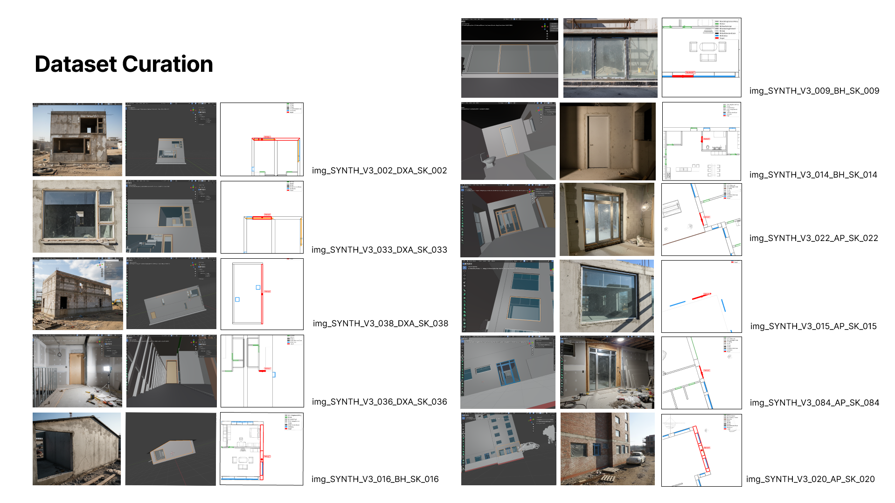
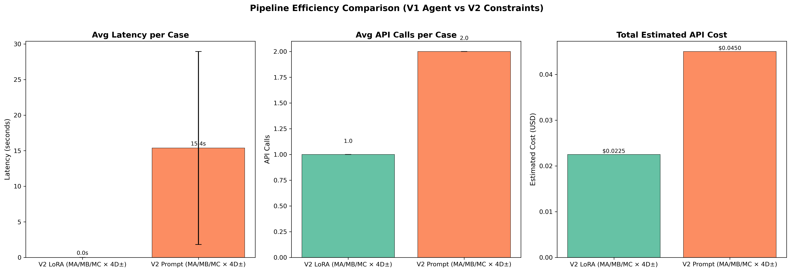
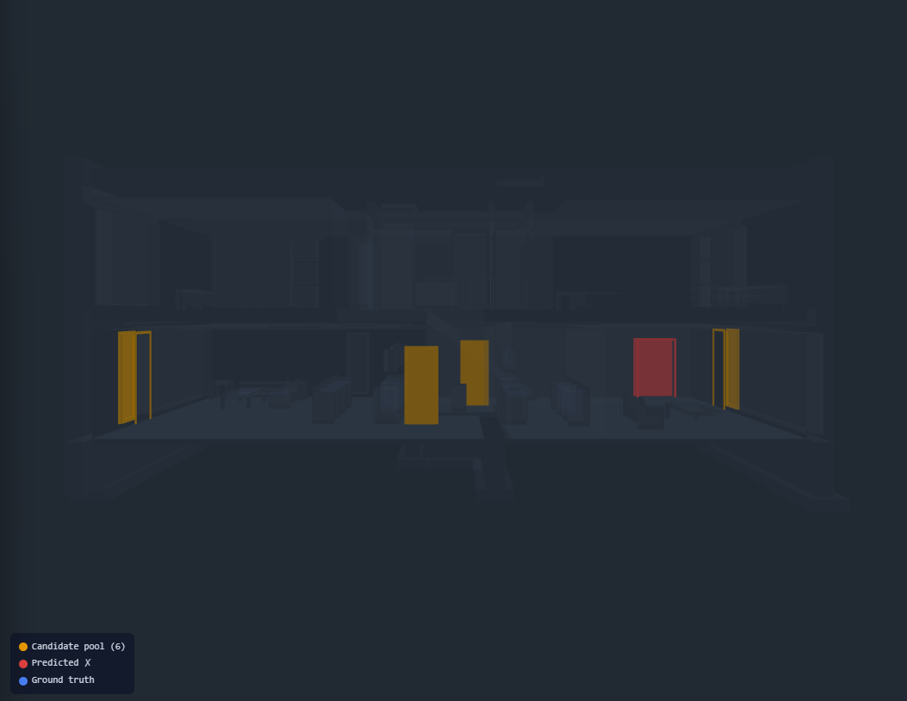
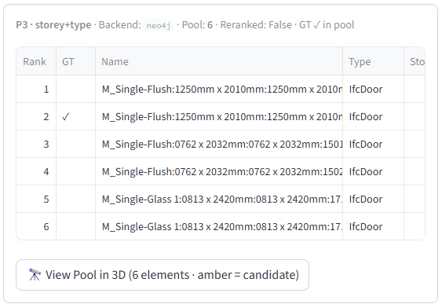

# Log

> Date: 25 Feb 2026
1. Data Pipeline: Synthetic Training Data ~933, Skeleton-Skin method
2. Current System Architecture: Constraint Algorithtm (v2) enhanced, incl finegrained rules & finetuned LoRA
-> Show Evaluation & Results
-> Show System Architecture
3. Demo Interface
4. Next: The Problem refine - emphasizing Visual Grounding, introduce scene graph
5. Questions:
> - What is your view on using spatial triplets to represent/encode topological relationships between elements as the grounding signal?  In my und these methods is more use in understanding Human Robotics Interaction.   
My motivation is that attribute-only retrieval hits a hard ceiling on identical elements, hence **spatial topology provides an orthogonal, geometry-derived dimension that can uniquely identify an element without relying on visual appearance, and it could be a more interesting move**.  
This is intended to address RQ1: reliable multimodal grounding to IFC in the digital model.
> - Are there professors/researchers or papers in Computer Vision — particularly in scene graph generation or visual grounding — that you would recommend as reference points for this direction?

---

## 1. Data Pipeline: Synthetic Training Data



**Skeleton-Skin Architecture:**
```
IFC geometry  →  deterministic skeleton (ground-truth labels, topology)
Gemini + Blender  →  noisy multimodal skin (photos, chat, floorplans)
```

**Pipeline steps:**
```
IFC model (IfcOpenShell)
  1. Build element index (attributes, storey, IFC class)
  2. Hunt skeletons → ground-truth labels per element
  3. Blender/Bonsai headless → wireframe renders per element
  4. Gemini 2.5 Flash → photoreal site photos from wireframes
  5. matplotlib → floorplan patches from IFC geometry
  6. Gemini → chat history + 4D metadata per case
  7. 3× text augmentation → Original / Vague ("look at this") / Urgent ("QA flagged")
  8. Format to Qwen2.5-VL ChatML → lora_train.jsonl + test_holdout.jsonl
```

**Dataset: synth_v0.4 — three IFC buildings:**

| Building | Type | Raw cases | Train (3× aug) | Holdout |
|----------|------|-----------|----------------|---------|
| **AdvancedProject (AP)** | 10-storey office | 250 | 690 | 20 |
| **BasicHouse (BH)** | 2-storey residential | 31 | 33 | 20 |
| **Duplex_A (DXA)** | Split-level duplex | 80 | 210 | 10 |
| **Total** | | 361 | **933** | **50** |

**LoRA_2 training — Qwen2.5-VL-7B:**

| Parameter | Value |
|-----------|-------|
| Base model | `unsloth/Qwen2.5-VL-7B-Instruct-bnb-4bit` |
| Adapter | LoRA r=16, alpha=32 |
| Training samples | 933 multimodal cases |
| Epochs | 3 · LR: 2e-4 · Effective batch: 16 |
| Max seq length | 2048 |
| Hardware | Modal A100 (40GB) |
| Task | [site photo + floorplan + chat] → constraints JSON |
| Inference latency | **0.3ms** (pre-computed) vs 15.4s (Gemini API) |

---

## 2. System Architecture + Evaluation & Results

### System Architecture


Two pipelines share the same backend and evaluation contracts — enabling controlled A/B comparison.

#### (a) V1 — Agent-Driven (Baseline)

A **LangGraph ReAct agent** using **MCP (Model Context Protocol)** to call IFC query tools freely.

```
Chat + Images + 4D metadata
  → Gemini 2.5 Flash (ReAct loop)
  → MCP tool calls: search_by_type, get_by_storey, match_image_to_elements
  → IFCEngine (IfcOpenShell)
  → Result (EvalTrace)
```

Works out of the box with no training — but non-deterministic, slow (~8 min / 84 cases), and hard to ablate.

#### (b) V2 — Constraints-Driven (Main Contribution)

Replaces free-form reasoning with an **explicit constraint extraction → deterministic query planning** pipeline.

<!--  -->

```
Chat + Images + 4D metadata
  → ConditionMask    (modality ablation: text / +photos / +floorplan / ±4D)
  → ImageParser      (Gemini VLM — cached structured descriptions)
  → ConstraintsExtractor  (Gemini prompt  OR  LoRA_2 adapter, 0.3ms)
  → QueryPlanner     (deterministic 7-priority cascade)
  → RetrievalBackend (memory index  OR  Neo4j Cypher  +  optional CLIP rerank)
  → EvalTrace + V2Trace
```

**Extracted schema** (Pydantic-validated, `src/v2/types.py`):
```json
{
  "storey_name": "6 - Sixth Floor",
  "ifc_class":   "IfcWindow",
  "near_keywords": ["north", "external"],
  "space_name": null,
  "target_name_keyword": null,
  "neighbor_type": "IfcColumn"
}
```

**Two extraction backends — swappable at runtime:**
- **Prompt-only** (Gemini 2.5 Flash) — zero-shot, 15.4s/case, $0.045/case
- **LoRA_2** (Qwen2.5-VL-7B, fine-tuned) — **0.3ms/case**, $0.023/case, **+9.6pp Top-1**

---

### Evaluation & Results

**6-condition modality ablation** — 50 holdout cases × 6 conditions × 2 profiles = 600 traces:

| Condition | Visual inputs | 4D context |
|-----------|--------------|------------|
| MA / MA- | Text only | ON / OFF |
| MB / MB- | + Site photos | ON / OFF |
| MC / MC- | + Floorplan | ON / OFF |

Paired comparison (MA vs MA-, MB vs MB-, MC vs MC-) isolates the pure 4D contribution.

#### Overall: LoRA_2 vs Prompt


| Metric | LoRA_2 | Prompt | Delta |
|--------|--------|--------|-------|
| **Top-1 Accuracy** | **35.3%** | 25.7% | **+9.6 pp** |
| Name Match | 67.7% | 60.0% | +7.7 pp |
| Valid SSR (GT retained) | 66.2% | 52.8% | +13.4 pp |
| Over-Reduction (GT lost) | 64.7% | 74.3% | −9.6 pp ✓ |

LoRA not only improves accuracy — it also reduces over-filtering, keeping the ground-truth element in the candidate pool more reliably.

#### Latency & Cost



| | LoRA_2 | Prompt |
|---|--------|--------|
| Avg latency/case | **0.0s** (precomputed) | 15.4s |
| API calls/case | 1.0 | 2.0 |
| Est. cost/case | **$0.023** | $0.045 |

#### Visual Modality Contribution


- **Floorplan adds the most (+10pp for LoRA)** — spatial layout is a strong geometric anchor
- Site photos alone (MB) add noise without spatial grounding (−2pp), potentialy due to dirty data -> need to improve the quality gate for synthetic data
- Prompt model's gains are inconsistent — fine-tuning is needed to exploit spatial signals reliably

#### 4D Context Impact


4D project context (floor schedule, active task) adds a **consistent +3–7pp across all modality levels**.
The gain is largest when combined with floorplan (MC: +7pp), confirming 4D and visual inputs are complementary.

#### Generalization Across Buildings


| Building | MA (Text+4D) | MB (+Photos) | MC (+Floorplan) | Key insight |
|----------|-------------|-------------|----------------|-------------|
| **AP** (10-storey office) | 8% | 5% | 10% | Densest building — near attribute entropy floor |
| **BH** (2-storey house) | 45% | **62%** | 60% | Photos give +18pp — few elements, easy disambiguation |
| **DXA** (split-level) | 35% | 30% | **45%** | Floorplan gives +15pp — complex spatial layout |

LoRA_2 generalizes across all three buildings without per-building fine-tuning.

#### Key Insights & Trade-offs

| What works | What doesn't (yet) | Engineering lesson |
|------------|-------------------|-------------------|
| V2 constraints pipeline: SSR > 80% consistently | AP building Top-1 ≈ 8% (near 1/46 floor) | Attribute filtering can't break homogeneity |
| LoRA adapter: 0.3ms inference, −9.6pp over-reduction | Storey extraction fails on vague chat | Wrong storey = catastrophic filter failure, not sure why |
| Floorplan grounding: +10pp for LoRA | Site photos can hurt on complex buildings -> dirty data | VLM needs spatial anchoring, not global scene |

---

## 3. Demo


*Live demo: left panel shows case selector + evaluation result. Center shows chat + input modalities. Right shows the 3D BIM viewer — green element = correct prediction, red = wrong.*

<table>
<tr>
<th>Query input — what the system receives:</th>
<th>Pipeline trace — interpretable step-by-step retrieval:</th>
</tr>
<tr>
<td></td>
<td></td>
</tr>
<tr>
<td></td>
<td></td>
</tr>
</table>

**LoRA vs Prompt — same case, same inputs:**

| LoRA_2 → **CORRECT** ✓ | Prompt → **WRONG** ✗ |
|---|---|
|  |  |

*Case 049 — DXA building (Duplex_A), fire door inspection, MC condition (text + photos + floorplan + 4D).
 LoRA retrieves the correct GUID; Prompt with identical inputs predicts wrong element (red = GT in right panel).*

| LoRA_2 (text only) → **CORRECT** ✓ | Prompt (text + photos + floorplan) → **WRONG** ✗ |
|---|---|
|  |  |

*Case 084 — AP building (10-storey office), IfcDoor.
LoRA with text-only input (MA) still outperforms Prompt with full multimodal input (MC).*

---

## 4. Next: The Problem Refined — Visual Grounding + Scene Graph

**Current Issue that worth to look at:** Visually identical elements cause a hard accuracy ceiling — attribute-based retrieval cannot distinguish them. The deeper challenge is **Multimodal Grounding**: mapping informal site data (natural language, photos, plans) to a precise IFC identifier, and linked to my RQ.

> **RQ1:** Can multimodal context (photos, floorplan, 4D schedule) identify the correct BIM element when elements are geometrically identical and only their spatial relationships differ?

**The fix:** A scene graph represents a visual scene as nodes (objects) connected by edges (relationships). Given a site photo, the model extracts a spatial triplet:
> e.g., *"window beside column"* → `[IfcWindow, ADJACENT_TO, IfcColumn]` — which is then used to retrieve the unique element from the graph database. Two elements that look identical in isolation can still have a unique topological fingerprint.

**Other methods I thought of:**
- CLIP similarity on model screenshots / point cloud matching — expensive and brittle at scale
- Traditional pipeline (segmentation → classifier → rule lookup) — cascading errors, poor generalization across building types

**The open challenge in scene graph generation:**
- *Traditional approach*: closed-vocabulary detectors with hand-annotated predicates (Wang et al. 2024) — high precision but brittle; predicate vocabulary must be fixed in advance
- *VLM approach*: generate scene graphs directly from pixels (Li et al. 2024; Wang et al. 2025) — flexible and open-vocabulary, but introduces **language-prior bias** (the model predicts relationships from language statistics rather than from what it actually sees) and **open-vocabulary drift** (hallucinating predicates not grounded in the scene)

**TODO:**
1. **V2.5 Neuro-Symbolic pipeline (LoRA_FT_3 + spatial triplets + Neo4j(exists))**
2. **synth_v0.5 (H2 hard-negative dataset, Relation Crops)**  


```
[PLANNED] V2.5 Architecture

NEURO LAYER (LoRA_FT_3 — Qwen2.5-VL-7B)
  <!-- New input: Relation Crop (union AABB of subject + reference element) -->
  New output: spatial_relations: [{subject, predicate, object}]
  Predicates: FILLS | CONTINUOUS | ADJACENT_TO | ON_TOP_OF

QUERY COMPILER (Python — zero LLM)
  spatial_triplet → Cypher template → Neo4j graph query
  Fallback: ADJACENT_TO → ON_STOREY → type-only (no regression)

SYMBOLIC LAYER (Neo4j)
  Pre-computed topological edges from IFC geometry
  Zero hallucination — no LLM in the retrieval step
```

**Relation Crop** is the core training innovation — instead of cropping a single element (Wang et al. 2025), crop the *interface boundary* between two elements. The model can't shortcut ("railings are near stairs") — it must reason from local pixel topology.

**Target benchmark (H2 hard negatives):**

| System | Top-1 on 46 identical elements |
|--------|-------------------------------|
| V2 LoRA_2 / CLIP baseline | ~2.2% (1/46) |
| V2.5 Neuro-Symbolic *(target)* | **60–80%** |

> **Reference cases (synth_v0.3):** `SYNTH_V3_090_SK_090`, `SYNTH_V3_120_SK_120`, `SYNTH_V3_138_SK_138`, `SYNTH_V3_156_SK_156`, `SYNTH_V3_159_SK_159` — and 7 others — all share the same profile: `candidate_density_k = 46`, `requires_relation = True`, `tier = T2`. These are the cases where V2 LoRA_2 scored **0%** (not even 2.2% — it returned a wrong candidate rather than abstaining). V2.5 targets these specifically by injecting the `ADJACENT_TO` / `FILLS` topological edge into the Cypher query, reducing the pool from 46 → 1 before any ranking step.

**Predicate vocabulary** (architectural model — no MEP):

| Predicate | Mining method | Est. instances |
|-----------|---------------|----------------|
| `FILLS` | `IfcRelFillsElement` (IFC schema) | ~389 |
| `CONTINUOUS` | Wall `Top ≠ storey_name` field | ~771 |
| `ADJACENT_TO` | Centroid distance < 1.5m | ~200–400 |
| `ON_TOP_OF` | Z-axis comparison + AABB overlap | ~19–40 |

`FILLS` and `CONTINUOUS` are free — extracted directly from the IFC schema without any geometry computation.

**Reference work**
| Dimension | Wang et al. 2024 | Wang et al. 2025 | **This work** |
|-----------|-----------------|-----------------|---------------|
| Domain | Manufacturing | General vision | **AEC / IFC** |
| Triplet output | Text scene graph | 2D bounding box | **IFC GlobalId (Cypher)** |
| Anti-shortcut strategy | 5-expert consensus | Single-element crop | **Relation-Region Crop** |
| Annotation source | Manual | PaLI-3 generated | **Geometric pre-computation (zero cost)** |
| Core metric | mR@20/100 | RefCOCO REC/RES | **mR@100 + H2-Top-1** |
