# Mid-Review Slides Draft
**Cross-Modal Alignment, Schema Mapping, and Compliance**
**MSCD Demo — Multi-modal Site-to-BIM Disambiguation**

> Goals: (1) Progress review (2) Emphasize contribution (3) Method sharing

---

## SLIDE 1 — Title

**Cross-Modal Spatial Mapping and Grounding for AEC Site Inspection**
*VLM-Assisted Constraint Retrieval and Structured Data Management*

- Student: [Your Name]
- Advisor: [Advisor Name]
- Carnegie Mellon University — [Program]
- February 2026 — Mid-Review

---

## SLIDE 2 — Motivation: The "Which Window?" Problem

**The core problem:**
> A site inspector sends a photo and a chat message. Which BIM element does it refer to?

**Concrete numbers (AdvancedProject IFC — 10-storey office):**

| Query | Candidates | Precision |
|-------|-----------|-----------|
| `"Which window?"` (text only) | **263** | 0.38% |
| + floor, task status, images (4D context) | **3** | 33.33% |

→ **98.9% search space reduction** from a single context layer

**Why is this hard?**

| Site reality | BIM model |
|---|---|
| Informal, egocentric ("that window over there") | Typed, allocentric (`IfcWindow` with GlobalId) |
| Visual, deictic ("look at this crack") | Geometric, attribute-based |
| 4D temporal ("the one being worked on now") | Relational schema |

**The deeper bottleneck:** When a floor has **46 geometrically identical IfcWindows**,
even perfect storey + class filtering leaves Top-1 = **1/46 = 2.2%** — a mathematical ceiling
that no attribute-based or vector-similarity retrieval can break.

> *Speaker note: This is the unresolved problem that drives the whole thesis. Every subsequent slide answers "how do we break 2.2%?"*

---

## SLIDE 3 — Research Landscape & Gap

**What exists in AEC + AI:**
- BIM authoring (Revit, ArchiCAD) — structured, expert-only, no site input
- LLM-based NLP for construction — text reasoning, no IFC grounding
- VLM visual inspection — image understanding, no schema mapping
- Rule-based IFC querying — rigid, not multimodal

**The gap:** No system takes **informal multimodal site input** and outputs a
**grounded, validated, reproducible BIM element identifier**.

**Research position:** An *interpreter layer* between messy site reality and the formal BIM model.

**Theory anchors motivating the approach:**

| Reference | Contribution | Relevance |
|-----------|-------------|-----------|
| Wang et al. 2024 (Industrial SGG) | AEC requires a predefined predicate vocabulary; open-domain VLMs hallucinate spatial relations | Motivates domain-specific predicate set |
| Wang et al. 2025 (VLM-VG) | Object-Centric Crops physically isolate background context, blocking language-prior shortcuts | Motivates anti-shortcut crop training strategy |
| Zhu et al. 2023/2025 (IFC-Graph) | IFC semantic relationships can be stored and queried as a graph | Motivates Neo4j Symbolic Layer |
| Iranmanesh et al. 2025 (Graph-RAG) | Graph traversal outperforms vector retrieval in AEC disambiguation | Motivates deterministic Cypher compilation |

**This work's claim:** Combining (1) Relation-Region Crops for VLM training and
(2) deterministic Cypher compilation breaks the attribute entropy bottleneck that
vector retrieval and attribute filtering cannot.

`[PLANNED — V2.5 not yet implemented; V2 baseline shown in results]`

---

## SLIDE 4 — Research Questions

| Layer | RQ | Focus | Key Challenge |
|-------|----|----|---|
| **Neuro** | **RQ1** | How can multimodal site evidence be grounded to architectural spatial predicates, overcoming VLM shortcut learning? | VLMs learn language-frequency shortcuts ("windows are on walls") rather than visual topology |
| **Symbolic** | **RQ2** | How can deterministic graph traversal eliminate retrieval hallucination while maintaining ontological compliance? | LLM-generated queries introduce fabricated GUIDs and non-existent properties |
| **Governance** | **RQ3** | Can the system reliably detect when an element cannot be identified and escalate? | Distinguishing "no match exists" from "retrieval failed" without ground truth |

**Thesis statement:**
> *"By grounding probabilistic Vision-Language Models in deterministic architectural topology graphs,
> this research proposes a Neuro-Symbolic interpreter layer that bridges the semantic gap between
> unstructured, egocentric site evidence and structured, allocentric IFC schemas.
> We demonstrate that **Relation-Region Crops** — targeting the interface boundary between two
> co-located elements — enable VLMs to extract long-tail architectural spatial predicates
> (`ADJACENT_TO`, `CONTINUOUS`) without shortcut learning, and that compiling these triplets
> into deterministic Cypher queries achieves zero-hallucination element retrieval in environments
> of extreme attribute entropy (46 geometrically identical elements per floor)."*

`[RQ1/RQ2 partially answered by V2 (attribute constraints + LoRA); spatial triplet extension is V2.5 PLANNED]`

---

## SLIDE 5 — Research Method: Constructive Design Research

**Methodology:** Constructive Design Research (Koskinen et al.)
- Build a functional prototype as the primary research vehicle
- Evaluate quantitatively against controlled synthetic benchmarks
- Reflect on system behavior to generate design knowledge

**Prototype:** MSCD Demo — two pipelines, shared backend, unified evaluation contracts

**Why synthetic data?**
Real site inspection reports are confidential and unstructured. Synthetic cases give:
- Deterministic ground-truth IFC GUID labels (no manual annotation)
- Controlled modality ablation (text / images / floorplan / 4D)
- Reproducible difficulty tiers (T1/T2/T3 and H1/H2/H3)

**Skeleton-Skin Separation Architecture** (synth pipeline design principle):
```
IFC geometry (deterministic) → Skeleton: topological ground-truth labels
Gemini + Blender rendering   → Skin:     noisy multimodal evidence wrapping the skeleton
```
This allows generating large-scale datasets without any manual annotation cost.

---

## SLIDE 6 — System Architecture Overview

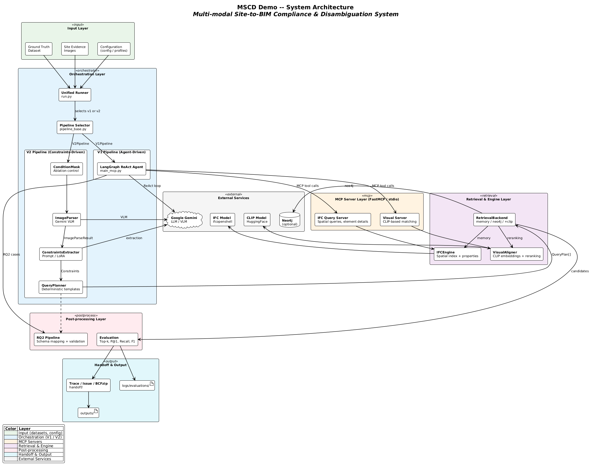

**Three layers:**
1. **Input Layer** — chat history, site photos, floorplan patch, 4D project metadata
2. **Pipeline Layer** — V1 (ReAct Agent, baseline) or V2 (Constraints-Driven, contribution)
   — both produce the same `EvalTrace` output contract
3. **Shared Backend** — IFCEngine (IfcOpenShell + spatial index), Neo4j graph, CLIP visual aligner

**Planned V2.5 extension** `[NOT YET IMPLEMENTED]`:
- Neuro Layer (LoRA_3) outputs `spatial_relations: List[SpatialTriplet]`
  in addition to existing `storey_name` / `ifc_class` constraints
- Symbolic Layer compiles triplets → Cypher → Neo4j topological edges
  (backward-compatible: existing Priority 1–7 cascade is the fallback)

---

## SLIDE 7 — V1 Pipeline: Agent-Driven Baseline

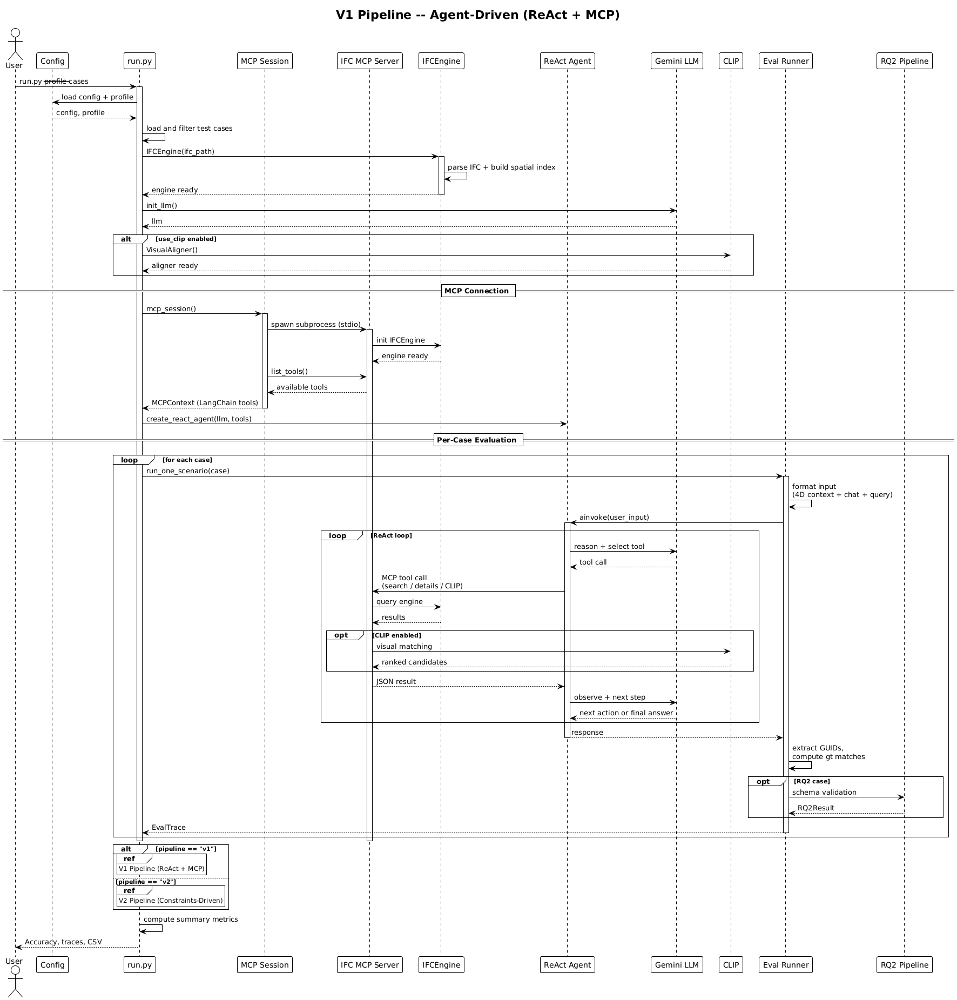

**Architecture:** LangGraph ReAct Agent + MCP (Model Context Protocol)

```
Input Case → Gemini 2.5 Flash (ReAct agent)
           → calls MCP tools freely (search_by_type, get_by_storey, match_image)
           → IFCEngine + optional CLIP reranker
           → EvalTrace
```

**Strengths:** Flexible, no training required, handles edge cases via free-form reasoning

**Weaknesses:**
- Non-deterministic — same input can give different retrieval paths
- Cannot isolate modality contribution (no controlled ablation)
- High latency (~8 min / 84 cases vs ~4 min for V2)
- Prompt-sensitive: agent reasoning varies with phrasings

**Role:** Baseline. V2 fixes interpretability and reproducibility; V2.5 fixes the precision ceiling.

---

## SLIDE 8 — V2 Pipeline: Constraints-Driven (Current Contribution)

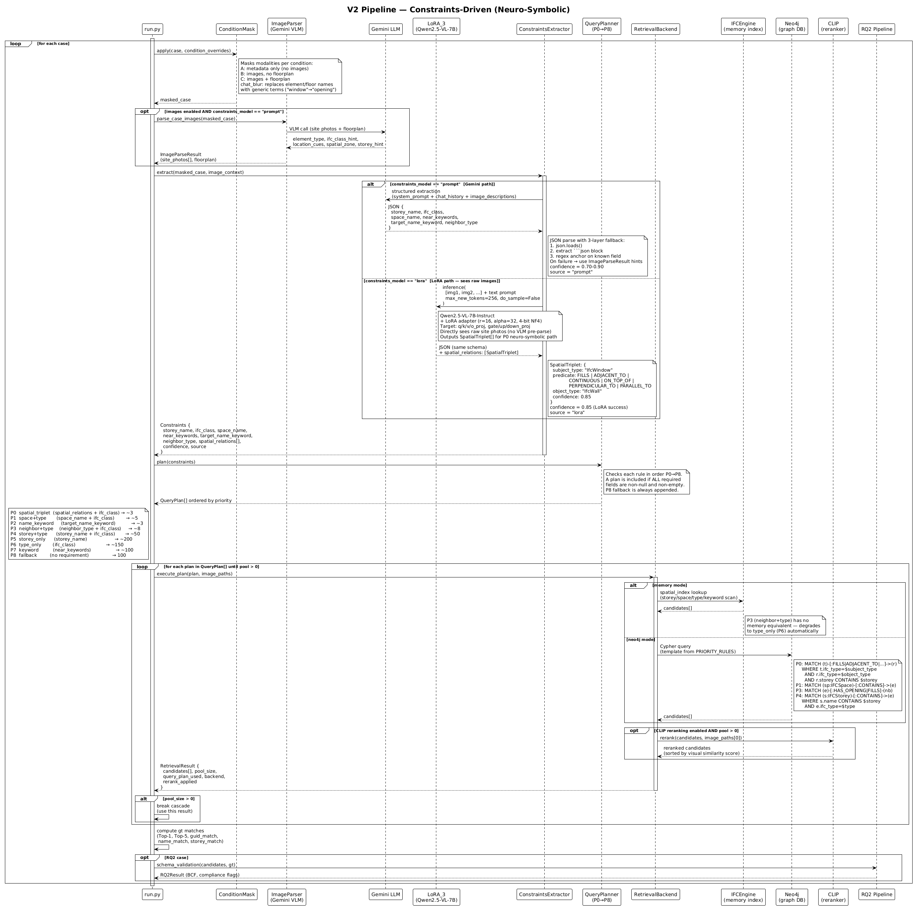

**Pipeline:**
```
Input Case
  → ConditionMask         (apply modality ablation: MA/MB/MC × 4D±)
  → ImageParser (VLM)     (Gemini 2.5 Flash: cached structured descriptions)
  → ConstraintsExtractor  (Gemini prompt OR LoRA_2 adapter → Constraints JSON)
  → QueryPlanner          (5-priority deterministic cascade)
  → RetrievalBackend      (memory OR Neo4j Cypher + optional CLIP rerank)
  → EvalTrace + V2Trace
```

**Current Constraints schema** (`src/v2/types.py` — implemented):
```json
{
  "storey_name": "6 - Sixth Floor",
  "ifc_class":   "IfcWindow",
  "near_keywords": ["north", "external"],
  "space_name": null,
  "target_name_keyword": null,
  "neighbor_type": "IfcColumn"
}
```

**V2.5 schema extension** `[PLANNED — not yet implemented]`:
```json
{
  "storey_name": "3 - Third Floor",
  "ifc_class":   "IfcWindow",
  "spatial_relations": [
    { "subject_type": "IfcWindow", "predicate": "ADJACENT_TO",
      "object_type": "IfcRailing", "confidence": 1.0 }
  ]
}
```
`spatial_relations` is a new optional field — existing Priority 1–7 cascade
activates when it is empty (zero regression risk).

**Two current extraction backends:**
- **Prompt-only** (Gemini 2.5 Flash) — zero-shot baseline
- **LoRA_2** (Qwen2.5-VL-7B, r=16) — fine-tuned on 933 multimodal samples

---

## SLIDE 8b — Demo: System in Action

**Demo overview — LoRA_2 (V2 pipeline, MC condition):**

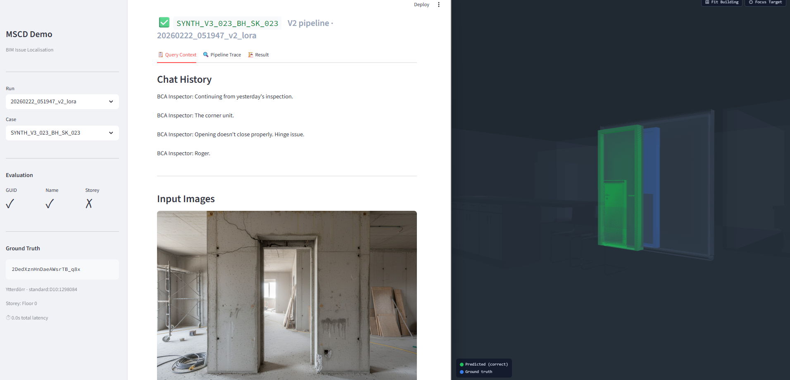

*Left panel: case selector + evaluation result (✓/✗ per metric). Center: chat history + input modalities. Right: 3D BIM viewer with predicted element highlighted (green = correct, red = wrong / blue = GT).*

---

### Query Input — What the system receives

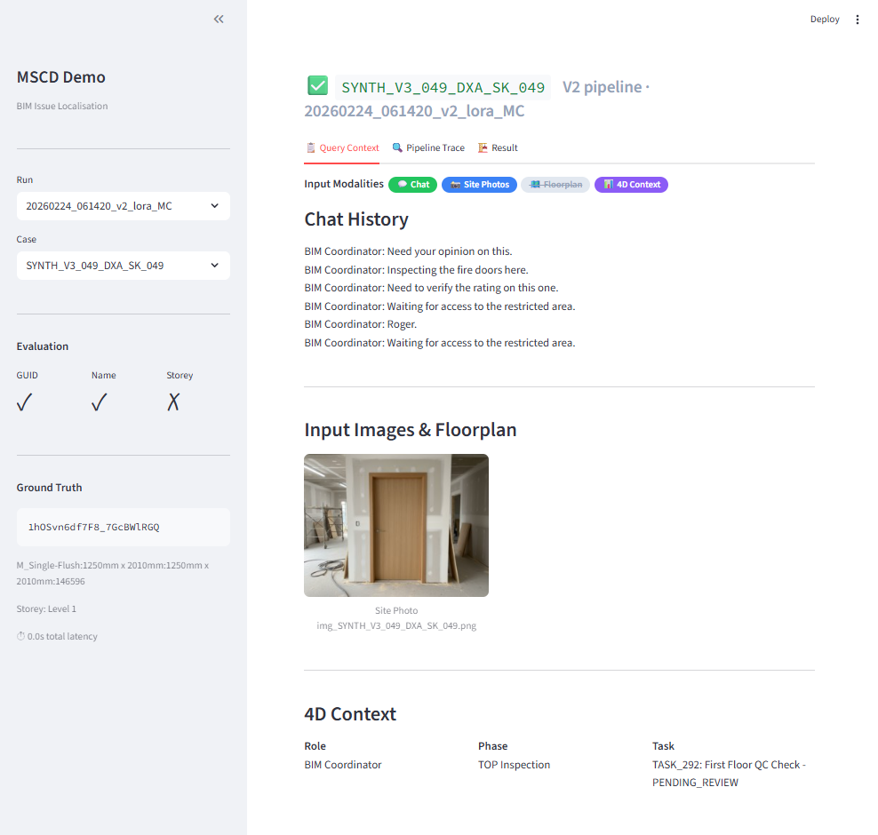

*Case SYNTH_V3_049_DXA_SK_049 — Duplex_A building, Condition MC (Chat + Site Photos + 4D Context active).
Chat: "Inspecting fire doors here. Need to verify fire rating." Site photo shows interior door.*

---

### Pipeline Trace — Interpretable retrieval steps

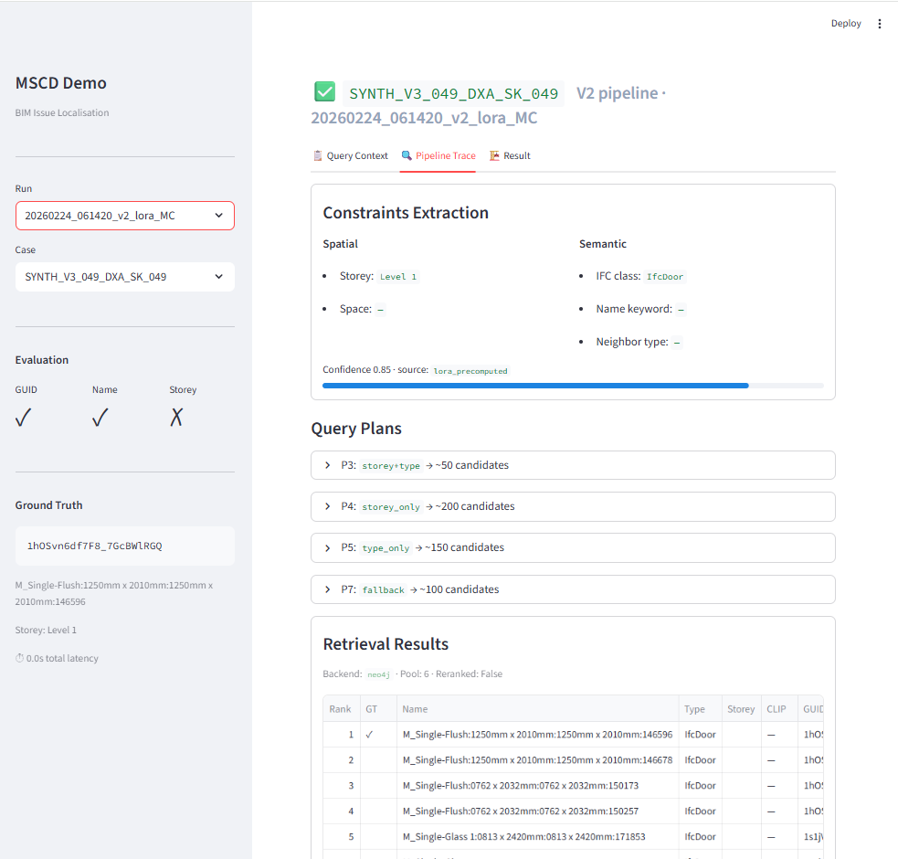

*Constraints extracted by LoRA_2: Storey = Level 1, IFC class = IfcDoor, confidence 0.85.
Query Planner cascades P3 (storey+type, ~50 candidates) → final pool: 6 candidates.
Rank 1 = ground truth (✓). Backend: Neo4j.*

---

### LoRA vs Prompt — Same case, different outcome

**Case 084 (AP building — IfcDoor):**

| LoRA_2 (MA — text only) — **CORRECT** ✓ | Prompt (MC — text + photos + floorplan) — **WRONG** ✗ |
|---|---|
| 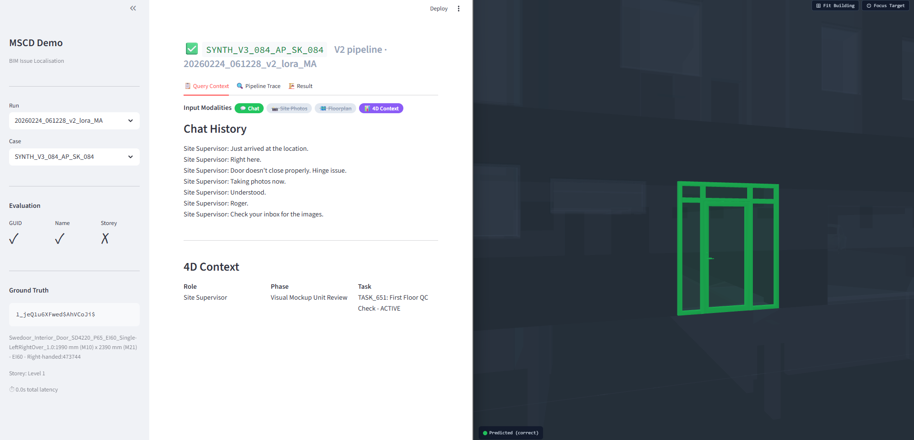 | 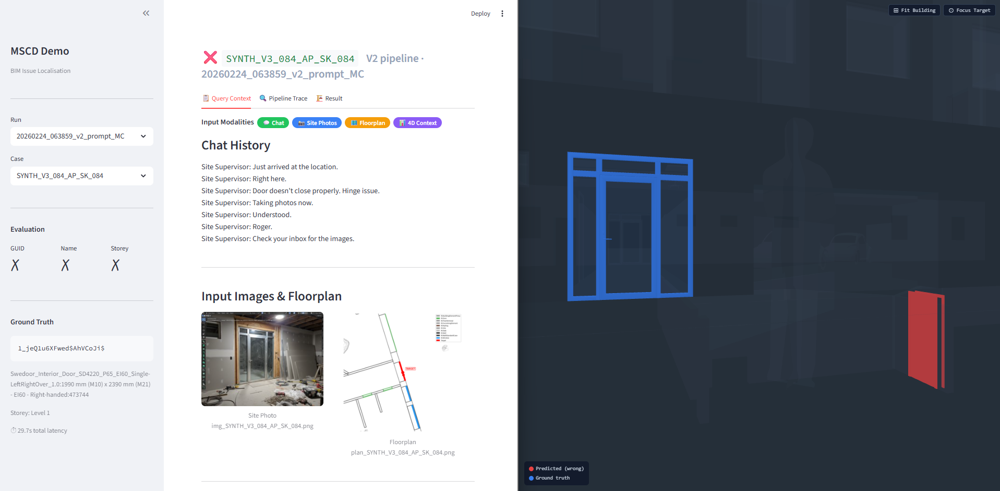 |

*LoRA correctly identifies the door with text + 4D context only (MA).
Prompt fails even with full multimodal input (MC). Predicted element shown in 3D viewer.*

---

**Case 049 (DXA building — IfcDoor, fire door inspection):**

| LoRA_2 (MC — full multimodal) — **CORRECT** ✓ | Prompt (MC — same inputs) — **WRONG** ✗ |
|---|---|
| 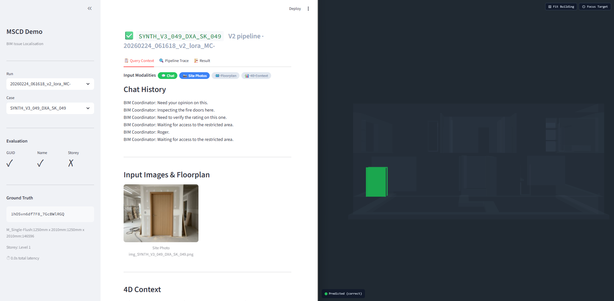 | 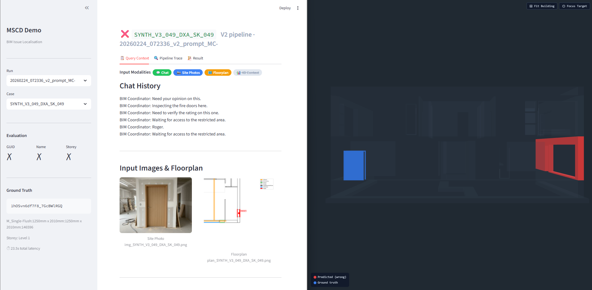 |

*Same input modalities, same building, same case — LoRA retrieves the correct GUID, Prompt does not.*

---

## SLIDE 9 — Evaluation Design: Synthetic Dataset & Modality Ablation

**Dataset overview:**

| Dataset | IFC Models | Cases | Use |
|---------|-----------|-------|-----|
| **synth_v0.3** | AdvancedProject (AP, 10-floor office) | 84 | V1 + V2 prompt baseline |
| **synth_v0.4** | AP + BasicHouse (BH) + Duplex_A (DXA) | 361 raw → 933 train + 50 holdout | LoRA_2 training + eval |

**6-Condition Modality Ablation (synth_v0.4, LoRA_2 evaluation):**

| Condition | Visual Inputs | 4D Context | Purpose |
|-----------|--------------|------------|---------|
| **MA** | Text only | ON | Text + 4D baseline |
| **MB** | Text + Site photos | ON | +Photos vs MA |
| **MC** | Text + Photos + Floorplan | ON | +Floorplan vs MB |
| **MA-** | Text only | OFF | MA without 4D |
| **MB-** | Text + Site photos | OFF | MB without 4D |
| **MC-** | Text + Photos + Floorplan | OFF | MC without 4D |

MA vs MA- / MB vs MB- / MC vs MC- isolates pure 4D contribution at each modality level.

**Evaluation metrics:**
- **Top-1 Accuracy** — exact GUID match in top-1 result
- **Search Space Reduction (SSR)** = `(N_initial − N_retrieved) / N_initial`
- **Valid SSR** — SSR where GT is retained (good); **Over-Reduction** — SSR where GT is lost (bad)
- **Field EM F1** — constraint field extraction accuracy vs ground-truth labels

---

## SLIDE 10 — Results: Overall Performance (LoRA_2 vs Prompt)

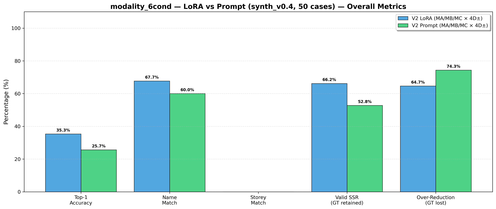

**synth_v0.4 · 50-case holdout · 6-condition ablation · 300 traces per profile:**

| Metric | V2 LoRA_2 | V2 Prompt | Delta |
|--------|-----------|-----------|-------|
| **Top-1 Accuracy** | **35.3%** | 25.7% | **+9.6 pp** |
| Name Match | 67.7% | 60.0% | +7.7 pp |
| Valid SSR (GT retained) | 66.2% | 52.8% | +13.4 pp |
| Over-Reduction (GT lost) | 64.7% | 74.3% | −9.6 pp ✓ |

**Key finding:** LoRA_2 not only improves top-1 accuracy — it also *reduces over-aggressive
filtering*, retaining ground-truth elements more reliably.

**Known ceiling:** Storey Match ≈ 0% for both profiles (storey extraction fails when informal
chat does not name the floor explicitly — targeted by V2.5 predicate relaxation fallback).

---

## SLIDE 11 — Results: Visual Modality Contribution

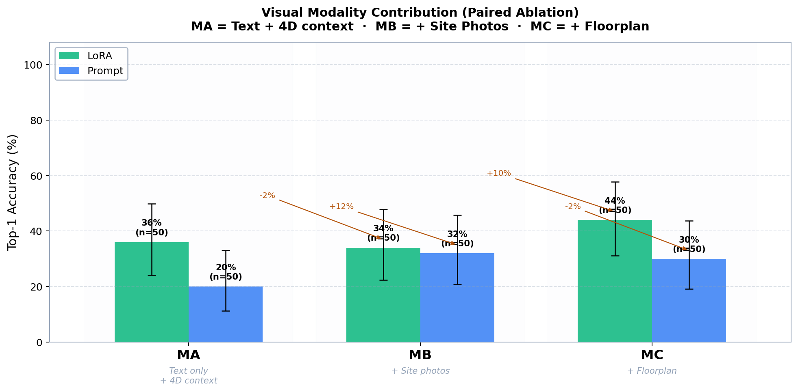

**Key question:** Does adding site photos (MB) or floorplans (MC) actually help?

**LoRA_2 — 4D ON conditions (n=50 each):**

| Condition | Top-1 | Δ from MA |
|-----------|-------|-----------|
| MA — Text + 4D | 36% | baseline |
| MB — + Site photos | 34% | −2% |
| MC — + Floorplan | **44%** | **+10%** |

**Prompt baseline:** MA 20% → MB 32% (+12%) → MC 30% (−2%)

**Interpretation:**
- Site photos (MB) do not reliably help alone — noisy without spatial anchoring
- **Floorplan (MC) gives the largest consistent boost** for LoRA_2 — spatial layout
  is a strong geometric constraint the adapter learns to exploit
- Prompt model's gains are inconsistent (no fine-tuning signal for spatial reasoning)

---

## SLIDE 12 — Results: 4D Project Context Impact

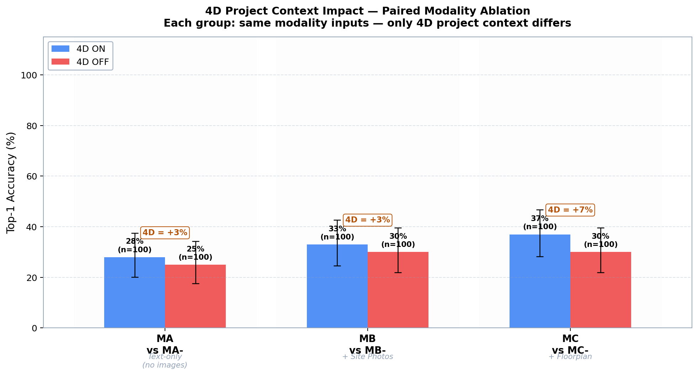

**Paired ablation — only 4D context differs (combined LoRA + Prompt, n=100 per pair):**

| Pair | 4D ON | 4D OFF | 4D Gain |
|------|-------|--------|---------|
| MA vs MA- | 28% | 25% | **+3%** |
| MB vs MB- | 33% | 30% | **+3%** |
| MC vs MC- | **37%** | 30% | **+7%** |

4D context provides a **consistent +3–7pp additive gain** across all modality levels.
The gain amplifies with richer visual context (MC), suggesting 4D and visual inputs are
**complementary, not redundant**.

**Implication for RQ1:** Temporal project context (floor schedule, task status) and
spatial visual context are independently useful disambiguation signals — fusing both
achieves the best results.

---

## SLIDE 13 — Results: Building Generalization (LoRA_2)

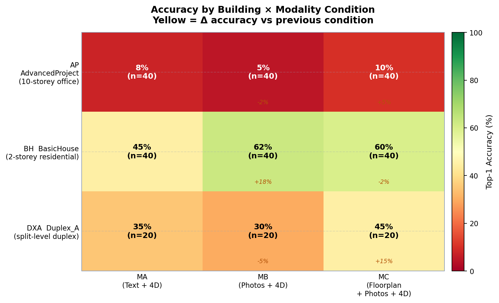

*LoRA_2 trained on AP + BH + DXA — does it generalize?*

| Building | MA (Text+4D) | MB (+Photos) | MC (+Floorplan) |
|----------|-------------|-------------|----------------|
| **AP** AdvancedProject (10-storey, 263 windows) | 8% | 5% | 10% |
| **BH** BasicHouse (2-storey residential) | 45% | **62%** | 60% |
| **DXA** Duplex_A (split-level duplex) | 35% | 30% | **45%** |

**Findings:**
- **AP is hardest**: extreme element density (46 identical windows/floor), storey ambiguity
  → precisely the H2 attribute-entropy regime that V2.5 targets
- **BH benefits most from photos (+18pp)**: small building, few elements, photos directly disambiguate
- **DXA benefits from floorplan (+15pp)**: split-level geometry is strongly spatial
- **Building type determines which modality matters** — one-size-fits-all retrieval is suboptimal

---

## SLIDE 14 — Key Insights & Failure Analysis

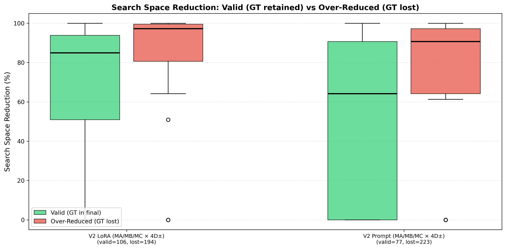

*(Box plots: LoRA valid SSR median ~85%, but over-reduction in 194/300 cases)*

**What works well (V2 + LoRA_2):**
- Constraints-driven pipeline achieves SSR > 80% consistently — dramatically narrows candidates
- LoRA_2 outperforms zero-shot Gemini by +9.6pp Top-1 and −9.6pp over-reduction
- 4D context + floorplan = most effective input combination

**Unresolved bottlenecks:**

| Bottleneck | Manifestation | V2.5 solution |
|-----------|--------------|---------------|
| **Attribute entropy** | AP: 46 identical windows/floor → Top-1 ≈ 8% (near 1/46 = 2.2%) | Topological triplet → Cypher → unique candidate |
| **Storey extraction failure** | Chat rarely names floor explicitly; wrong storey = catastrophic filter | Predicate relaxation fallback (`ADJACENT_TO` → `ON_STOREY`) |
| **Site photo noise** | Photos help simple buildings (BH +18%), hurt complex ones (AP −2%) | Relation Crop focuses on interface boundary, not global scene |

---

## SLIDE 15 — Progress Summary

**Implementation status:**

| Component | Status |
|-----------|--------|
| V1 pipeline (ReAct + MCP) | ✅ Complete & evaluated |
| V2 pipeline (Constraints-Driven, prompt + LoRA) | ✅ Complete & evaluated |
| synth_v0.3 (84 cases, AP) | ✅ Complete |
| synth_v0.4 (361 cases, AP + BH + DXA, 3× augmented) | ✅ Complete |
| LoRA_2 training (Qwen2.5-VL r=16, 933 samples, 3 epochs) | ✅ Trained on Modal A100 |
| 6-condition modality ablation (300 traces × 2 profiles) | ✅ Complete |
| Phase 5: fine-grained constraints (space_name, neighbor_type) | ✅ Schema added |
| BCF 2.1 handoff output | ✅ Complete |
| RQ2 CORENET-X schema validation | ✅ Complete |
| **V2.5 Neuro-Symbolic pipeline (LoRA_3 + spatial triplets + Neo4j)** | 🔲 PLANNED |
| **synth_v0.5 (H2 hard-negative dataset, Relation Crops)** | 🔲 PLANNED |

**Key result so far:** LoRA_2 reaches **35.3% Top-1** on 50-case holdout (3 building types).
Prompt baseline: 25.7% (+9.6pp). AP building (hardest, densest) remains near the 2.2% floor.

---

## SLIDE 16 — Next Steps: V2.5 Neuro-Symbolic Pipeline

**The bottleneck** (from AP results): 46 identical `IfcWindow` elements per floor.
Attribute retrieval Top-1 = **2.2%** (1/46). Cannot be broken by CLIP or text attribute matching.

**Solution — Topological Orthogonality:**
Even if elements are intrinsically identical, their *extrinsic spatial relationships* in 3D
are unique and deterministic. V2.5 introduces this as an independent information dimension.

---

### Architecture (V2.5) `[PLANNED]`

```
┌─────────────────────────────────────────────────┐
│  Multimodal Input (same as V2)                  │
└────────────┬────────────────┬────────────────────┘
             │                │
  ┌──────────▼────────────────▼──────────┐
  │   NEURO LAYER — LoRA_3  [PLANNED]   │
  │   Qwen2.5-VL-7B + LoRA r=16        │
  │                                     │
  │   Crop Strategy:                    │
  │   · Object Crop  → IFC class ID     │  ← Wang et al. 2025
  │   · Relation Crop → predicate ID    │  ← THIS WORK
  │                                     │
  │   Output: Constraints (extended)    │
  │   { storey_name, ifc_class,         │
  │     spatial_relations: [            │
  │       {subject, predicate, object}  │
  │     ]}  ← Pydantic validated        │
  └──────────────┬──────────────────────┘
                 │ predicate ∈ {FILLS, CONTINUOUS,
                 │              ADJACENT_TO, ON_TOP_OF}
  ┌──────────────▼──────────────────────┐
  │   QUERY COMPILER — Python [PLANNED] │
  │   Zero LLM / fully deterministic   │
  │   Priority 0: spatial_triplet Cypher│  ← NEW
  │   Priority 1–7: existing cascade    │  ← unchanged fallback
  │   Fallback: ADJACENT_TO → ON_STOREY │
  └──────────────┬──────────────────────┘
                 │ Cypher query
  ┌──────────────▼──────────────────────┐
  │   SYMBOLIC LAYER — Neo4j  [PLANNED] │
  │   -[:FILLS]->       (IFC schema)    │
  │   -[:CONTINUOUS]->  (IFC constraint)│
  │   -[:ADJACENT_TO]-> (centroid<1.5m) │
  │   -[:ON_TOP_OF]->   (Z-axis+AABB)   │
  └─────────────────────────────────────┘
```

---

### Architectural Predicate Vocabulary `[PLANNED]`

*Note: earlier plan used MEP predicates (`INTERSECTS`, `CANTILEVERED_OVER`) — deprecated because
AdvancedProject.ifc has **zero MEP elements**. Replaced with architectural predicates:*

| Predicate | Definition | Mining method | Est. instances |
|-----------|-----------|---------------|----------------|
| `FILLS` | Door/window occupies a wall opening | `IfcRelFillsElement` — already in IFC schema | ~389 |
| `CONTINUOUS` | Wall spans multiple storeys | `Top constraint ≠ storey_name` — **no geometry** | **771** |
| `ADJACENT_TO` | Centroid distance < 1.5m (same storey, different type) | `ifcopenshell.util.placement` | ~200–400 |
| `ON_TOP_OF` | `Z_min(subject) > Z_max(object)` + XY AABB overlap | Z-axis comparison | ~19–40 |

`FILLS` and `CONTINUOUS` are **free** (IFC schema / field, no geometry needed).
`ADJACENT_TO` and `ON_TOP_OF` require centroid extraction (P1 task, ~2–3 days).

---

### Relation-Region Crop — Core Training Innovation `[PLANNED]`

*Extends Wang et al. 2025 from entity identification to **relation identification**:*

```
Object Crop  (Wang et al. 2025):
  Crop:   tight AABB around single target element (256×256)
  Learns: "this pixel texture = IfcRailing"
  Blocks: background scene language prior

Relation Crop  (THIS WORK):
  Crop:   union AABB of subject + object + 20% padding
  Learns: "window + railing in this spatial config = ADJACENT_TO"
  Blocks: global scene language prior
          ("railings are usually near stairs" → model must use local pixel topology)
```

---

### H2 Hard-Negative Benchmark `[PLANNED]`

```
3rd floor: 46 identical IfcWindow elements (same size, material, IFC class)
Site photo: a window next to a staircase railing (IfcRailing)

Ground truth:  (IfcWindow) -[:ADJACENT_TO]-> (IfcRailing, storey="3 - Third Floor")

Attribute baseline (V2 / CLIP):    Top-1 = 1/46 = 2.2%   ← mathematical lock
V2.5 Neuro-Symbolic target:        Top-1 = 60–80%         ← 27–36× improvement
```

---

### synth_v0.5 & Codebase Plan `[PLANNED]`

**Target: 800–1,000 high-quality triplet-annotated samples**

```
Phase 1 — Skeleton Mining (Day 1–3)
  hunt_FILLS()       → IfcRelFillsElement (free, ~389 instances)
  hunt_CONTINUOUS()  → wall Top ≠ storey field (free, ~771)
  hunt_ADJACENT_TO() → centroid distance < 1.5m (~200–400 pairs)

Phase 2 — H2 Hard-Negative Construction (Day 3–4)
  50 eval-only test cases (not used for training)

Phase 3 — Skin Generation (Day 4–6)
  image_global.png        ← existing Blender/Bonsai pipeline
  image_relation_crop.png ← NEW: union AABB of subject+object
  text_chat               ← Gemini (relation-aware, no GUID/IfcClass)

Phase 4 — LLM-as-Judge Filter (Day 6–7)
  Filter rate ~20–30% → 800–1,000 final samples
```

**Codebase fix priority queue:**

| Priority | Task | Unlocks |
|----------|------|---------|
| **P0** | Fix Neo4j connection | Graph vs. vector experiments valid |
| **P0** | Verify `FILLS` edges in Neo4j | Free topological predicate |
| **P1** | `1_build_index.py` — centroid XYZ extraction | `ADJACENT_TO`, `ON_TOP_OF` |
| **P1** | `types.py` — add `spatial_relations` field | LoRA_3 output schema |
| **P1** | `constraints_to_query.py` — Priority 0 Cypher rule | Full neuro-symbolic path |

**Critical path: P0 → P1 → synth_v0.5 → LoRA_3 → Evaluate**

---

## SLIDE 17 — Next Steps: Innovation Position & Timeline

**How V2.5 advances beyond prior work:**

| Dimension | Wang et al. 2024 | Wang et al. 2025 | **This work** |
|-----------|-----------------|-----------------|---------------|
| Domain | Manufacturing | General vision | **AEC / IFC** |
| Triplet output | Text scene graph | 2D bounding box | **IFC GlobalId (Cypher)** |
| Anti-shortcut strategy | 5-expert consensus | Single-element crop | **Relation-Region Crop** |
| Annotation source | Manual | PaLI-3 generated | **Geometric pre-computation (zero cost)** |
| Core metric | mR@20/100 | RefCOCO REC/RES | **mR@100 + H2-Top-1** |

**Timeline:**

| Phase | Task | Target |
|-------|------|--------|
| **Week 1–2** | P0/P1 codebase fixes (Neo4j + centroid extraction) | — |
| | `synth_v0.5` skeleton mining (FILLS, CONTINUOUS, ADJACENT_TO) | — |
| **Week 2–4** | Relation Crop generation, text skin (Gemini), LLM-as-Judge filter | 800–1,000 samples |
| **Week 4–5** | LoRA_3 training on Modal A100 (3 images, `spatial_relations` output) | — |
| **Week 5–7** | V2.5 evaluation: H2-Top-1 vs B1/B2/B3/B4, mR@100 per predicate | — |
| **Month 3** | Final evaluation chapter, limitations, RQ3 escalation analysis | — |
| **Month 3–4** | Thesis writing | — |

**Core thesis argument by end:**
1. Multimodal context narrows BIM search space (RQ1 — ✅ shown in V2)
2. LoRA fine-tuning outperforms zero-shot LLM for constraint extraction (RQ1 — ✅ shown)
3. Topological spatial relations break the attribute entropy ceiling (RQ1 — 🔲 V2.5 target)
4. Structured output validates against AEC regulatory schemas (RQ2 — ✅ shown)
5. Empty retrieval after predicate relaxation is a reliable escalation signal (RQ3 — partial)

---

## APPENDIX A — Data Synthetic Pipeline

```
IFC Model (IfcOpenShell)
  ↓ 1_build_index.py      → element index (+ centroid XYZ in V2.5)
  ↓ 2_hunt_skeletons.py   → GT labels (FILLS/CONTINUOUS/ADJACENT_TO in V2.5)
  ↓ 3_render_wireframes   → Blender renders + relation crops (new in V2.5)
  ↓ 4_generate_photos     → Gemini: photoreal site photos
  ↓ 5_generate_cases      → LLM: chat history + 4D metadata
  ↓ 6_augment_text        → 3× augmentation: Original / Vague / Urgent
  ↓ 7_prepare_lora_data   → Qwen2.5-VL ChatML format, merge buildings
  →  lora_train.jsonl (933 V2 / ~1,733 V2.5) + test_holdout.jsonl (50)
```

| Tag | Building | Train | Holdout |
|-----|----------|-------|---------|
| AP | AdvancedProject (10-storey, 263 windows, 762 walls) | 690 | 20 |
| BH | BasicHouse (2-storey residential) | 33 | 20 |
| DXA | Duplex_A (split-level duplex) | 210 | 10 |

---

## APPENDIX B — LoRA_2 Training Details (Current)

| Parameter | Value |
|-----------|-------|
| Base model | `unsloth/Qwen2.5-VL-7B-Instruct-bnb-4bit` |
| Adapter | LoRA r=16, alpha=32 |
| Training samples | 933 (AP=690, BH=33, DXA=210) |
| Epochs | 3 · LR: 2e-4 · Effective batch: 16 · Max seq: 2048 |
| Hardware | Modal A100 (40GB) |
| Task | [site photo + floorplan + chat] → constraints JSON |

**LoRA_3 planned changes** `[NOT YET IMPLEMENTED]`:
- New input: `image_relation_crop.png` (3rd image)
- New output: `spatial_relations: List[SpatialTriplet]`
- Max seq: 4096 · Training samples: ~1,733

---

## APPENDIX C — V2.5 Evaluation Baselines & Metrics

| Baseline | What it proves when outperformed |
|----------|----------------------------------|
| **B1** Dense Vector (CLIP) | Attribute entropy defeats vector retrieval |
| **B2** V2 Prompt-only | Text-only extraction bottleneck |
| **B3** V2 LoRA_2 | Attribute constraints insufficient for identical-element disambiguation |
| **B4** V2.5 LoRA_3 + triplets + Neo4j | Full neuro-symbolic pipeline |

| Metric | Test set | Baseline | Target | Proves |
|--------|----------|----------|--------|--------|
| **Top-1 on H2** | 50 ADJACENT_TO hard-negatives (~46 distractors) | 2.2% | 60–80% | Topology breaks entropy ceiling |
| **mR@100 per-predicate** | Full set, grouped by predicate | FILLS highest | ADJACENT_TO ≥ FILLS | VLM learned visual topology, not language frequency |
| **SSR** | Full set | 92.65% | ≥ 92% | Efficiency maintained |

---

## APPENDIX D — Plot Index

All plots: `mscd_demo/docs/plots/0224_modality_6cond/`

| File | Used in | Shows |
|------|---------|-------|
| `1_overall_metrics.png` | Slide 10 | LoRA 35.3% vs Prompt 25.7% — 5 metrics |
| `2_condition_comparison.png` | — | Per-condition bar (MA/MA-/MB/MB-/MC/MC-) |
| `3_search_space_reduction.png` | Slide 14 | SSR box plots: valid (GT retained) vs over-reduced |
| `4_efficiency_comparison.png` | — | Latency comparison |
| `5_accuracy_heatmap.png` | — | Accuracy heatmap overall |
| `6_accuracy_heatmap_details.png` | — | Detailed per-case heatmap |
| `6b_full_condition_heatmap.png` | — | Full 6-condition heatmap |
| `7_modality_gain.png` | — | T1/T2/T3 difficulty × modality |
| `8_difficulty_degradation.png` | — | T1→T2→T3 accuracy drop |
| `9_density_vs_accuracy.png` | — | Candidate density vs accuracy scatter |
| `9_modality_stack_MA_MB_MC.png` | Slide 11 | Visual modality contribution (MA/MB/MC × LoRA/Prompt) |
| `11_modality_x_building.png` | Slide 13 | Accuracy heatmap: building × modality |
| `12_4d_paired_ablation.png` | Slide 12 | 4D ON vs OFF paired comparison |
| `13_modality_dual_profile.png` | — | All 12 conditions, line + bar dual view |

---

## APPENDIX E — Screenshot Index

All screenshots: `mscd_demo/docs/screenshots/`

| File | Used in | Shows |
|------|---------|-------|
| `0_demo_lora.png` | Slide 8b | Full demo overview: chat, image input, 3D BIM viewer |
| `query_input.png` | Slide 8b | Query Content tab: chat + site photo + 4D context (Case 049, DXA) |
| `query_plan.png` | Slide 8b | Pipeline Trace: constraints extraction + query plan cascade + ranked results |
| `1_084_lora_T.png` | Slide 8b | Case 084 (AP, IfcDoor) — LoRA MA → **CORRECT** ✓ |
| `1_084_prompt_F.png` | Slide 8b | Case 084 (AP, IfcDoor) — Prompt MC → **WRONG** ✗ |
| `2_049_lora_T.png` | Slide 8b | Case 049 (DXA, fire door) — LoRA MC → **CORRECT** ✓ |
| `2_049_prompt_F.png` | Slide 8b | Case 049 (DXA, fire door) — Prompt MC → **WRONG** ✗ |
| `demo_049.gif` | — | Animated walkthrough of Case 049 |
