## 1. Title

> 🎤 **[~10s]:** Hi everyone, thanks for being here. My thesis is about building an interpreter layer for AEC — specifically, how AI can reliably map unstructured site evidence to structured BIM data. Today I'll cover the gap I'm addressing, my approach, current results, and what's next.

**An Interpreter Layer for AEC**
*Cross-Modal Alignment, Schema Mapping, and Compliance*

---

**Chia Hui Yen**
CMU School of Architecture · College of Fine Arts

Committee: Prof. Joshua Bard (Chair) · Prof. Daniel Cardoso Llach

*Mid-Progress Review · February 2026*

## 2. Motivation, Research Landscape & Gap

> 🎤 **[~45s]:** Three AI trajectories are actively reshaping AEC practice. First, tools that streamline data — multimodal training to handle heterogeneous inputs. Second, conditional generation — text-to-BIM authoring. Third, context understanding — LLM workflows for site monitoring and compliance. But none of these close the full loop. As projects grow more complex — prefab, DfMA — evidence, models and schemas drift apart across design, fabrication, site and regulatory submission. That bridging role remains manual and error-prone. My thesis asks: can we automate the interpreter?

> note: Start the motivation of research from a higher level, such as cross modality mapping etc. --> How to bridge physical - digital -> How it helps CMs

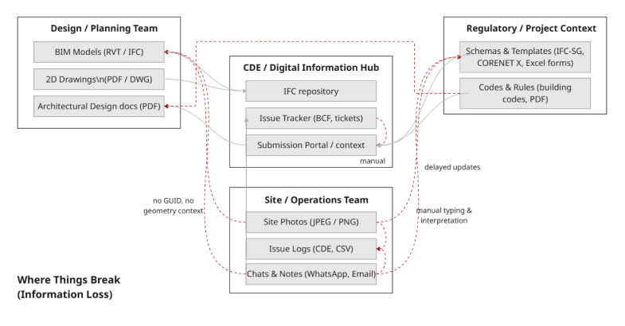
<!-- Workflow images: design → fabrication → site → regulatory submission handoff diagram -->

**Motivation: The Interpreter Gap in AEC Workflows**

Three converging AI trajectories are reshaping AEC practice — yet none closes the full loop from unstructured site evidence to schema-compliant project data:
- **Streamlining data and computation** — multimodal training to handle heterogeneous AEC inputs [35]
- **Conditional design generation** — text-to-BIM and LLM-driven authoring [11, 24]
- **Context understanding and orchestration** — LLM workflows for site monitoring and compliance [28, 31]

As projects grow in complexity (e.g., PPVC, DfMA), evidence, models and schemas drift apart across design, fabrication, site and regulatory submission — the **interpreter** role remains manual and error-prone.


<!-- author diagram: three-column landscape with examples for each column -->

**Current Landscape — three active fronts:**

1. **AEC Tech Tools** — Design-intent to model pipelines:
   - Conditional generation gains traction: Img2CAD [36], Text2BIM [11], MCP4IFC [24].
   - Most work targets design authoring; downstream regulatory schemas and cross-modal evidence alignment remain underexplored.

2. **Digital Platforms** — Shift in interoperability logic:
   - openBIM and IFC [9, 25] provide a structured data foundation; regulatory contexts such as CORENET X [4] and IFC-SG [3] extend this to compliance submission.
   - In practice, links between site issues, IFC elements and compliance schemas remain mostly manual and fragmented.

3. **AI Technologies** — Multimodal models meet domain data:
   - Foundation models (CLIP, GPT-3, DALL·E) open strong general reasoning [27]; NLP methods are applied in AEC for document understanding [13, 30].
   - Synthetic and idealised datasets expand training coverage [1, 26], but domain-specific graph topology (IFC hierarchy, spatial predicates) is rarely modelled.

> **Refs:** [11] Text2BIM · [24] MCP4IFC · [28, 31] LLM orchestration · [35] Multimodal AEC · [36] Img2CAD · [9, 25] openBIM/IFC · [4] CORENET X · [3] IFC-SG · [27] CLIP/GPT-3 · [13, 30] NLP in AEC · [1, 26] Synthetic datasets

## 3. Gap → RQ

> 🎤 **[~45s]:** The gap has three dimensions. Semantically, existing tools can see a photo but can't reliably ground it to the topological logic of the IFC graph — they translate between modalities without indexing into the schema. Workflow-wise, linking site observations to IFC elements to compliance records is still entirely manual — no system closes this full loop. And from an AI perspective, general-purpose VLMs don't handle domain-specific topology — IFC hierarchies, spatial predicates, construction-level detail. Together these define the gap statement on screen: we need an interpreter that is simultaneously multimodal, schema-aware, and hallucination-free.


<!-- author diagram: three-column gap map aligned with landscape_map.png, one gap per column -->

**Three gaps identified** (aligned with the landscape):

1. **Semantic Gap** — Visual evidence vs. schema-structured data
   - Existing tools (Img2CAD, Text2BIM, CAD-MLLM, MCP4IFC) translate between modalities but do not reliably ground visual perception to the topological logic of the IFC graph [36, 11, 32, 24, 38].
   - An interpreter must not just "see" a site photo — it must index into the rigorous spatial and hierarchical structure of IFC.

2. **Workflow Gap** — Manual bridging between physical and digital worlds
   - In practice, linking site observations to IFC elements and compliance records is manual and costly; specialised tracking (e.g., RFID + BIM [16]) is expensive and not generalised.
   - No system currently closes the full loop: unstructured field evidence → IFC element → regulatory schema check.

3. **AI Technology Gap** — General-purpose models in a domain-specific context
   - *Data format mismatch:* multimodal training corpora target generic computer vision formats; IFC graph hierarchies and spatial predicates are rarely modelled [27, 24, 35].
   - *Domain specificity:* strong general visual reasoning (GPT-4) does not transfer to construction-specific details — joints, reinforcement, element-level topology [6, 23, 30].
   - *Orchestration need:* domain-specialised tools must be coordinated by an agentic layer [6, 23]; ad-hoc pipelines do not generalise.
   - *Generation vs. interpretation:* most work generates geometry (Text2BIM, Img2CAD) without engaging downstream regulatory schemas [11, 19].

**Gap statement:** We lack an *interpreter layer* that is simultaneously **multimodal** (site photo + floorplan + metadata), **schema-aware** (IFC graph topology, not just attributes), and **hallucination-free** (zero fabricated GUIDs or non-existent properties).

> Research method: Constructive Design Research (CDR) — prototype as experiment site, mapping each RQ to a measurable action in the demo.

> **Refs:** [11, 19] Text2BIM/Img2CAD · [24] MCP4IFC · [32] CAD-MLLM · [36] Img2CAD · [38] IFC-Graph · [16] RFID+BIM · [27] Foundation models · [35] Multimodal AEC · [6] Agentic layer · [23] Multi-agent AEC · [30] NLP in AEC

## 4. RQ → Map to a Real Action in Demo

> 🎤 **[~60s]:** This table maps each research question directly to a concrete, measurable prototype action — which is the CDR methodology in practice. RQ1 asks whether a LoRA fine-tuned VLM can extract reliable spatial triplets from multimodal input. I measure this with Top-1 accuracy and SSR across 6 modality conditions. RQ2 asks whether a deterministic query compiler can maintain zero hallucination — my symbolic layer produces 100% GT-in-pool with zero fabricated GUIDs, which I verify on a 83-case hard-negative eval set. RQ3 asks whether the system can detect when it's failing and escalate without ground-truth labels — tested with a confidence scoring and two-step predicate relaxation on H2 hard-negative cases. The key claim: the prototype is simultaneously the research instrument and the experiment site.

> note: "What I am going to showcase & experiment in Demo/Prototype?"
> note: Show the relationship between RQ → query → actions in demo

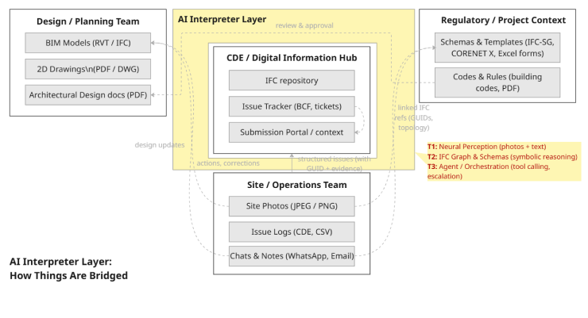

<!-- author diagram: three rows (RQ1/RQ2/RQ3) mapped to prototype components and measurable actions -->

**Main RQ:** How can an AI interpreter layer reliably align unstructured multimodal site evidence with structured project data in AEC workflows — with minimal information loss, ontological compliance, and no hallucination?

| Layer | Sub-RQ (from thesis §1.5) | Prototype Action | Measurable Outcome |
|---|---|---|---|
| **Neuro** | **RQ1** — How can multimodal site evidence be grounded to architectural spatial predicates, overcoming shortcut learning in VLMs? | LoRA fine-tuned VLM (Qwen2.5-VL-7B) trained on Relation-Region Crops → outputs `SpatialTriplet` | Top-1 accuracy, SSR, modality ablation across 6 conditions |
| **Symbolic** | **RQ2** — How can an ontology-aware retrieval layer eliminate hallucination while maintaining schema compliance with IFC and PEFT-aligned representations? | Deterministic Cypher compiler (no LLM) → Neo4j graph traversal with IFC-Graph [38] and priority-ranked query planner | GT-in-pool@100%, zero fabricated GUIDs, fallback rate |
| **Governance** | **RQ3** — Can the system reliably detect retrieval failure and escalate appropriately without access to ground truth labels? | Confidence scoring + two-step predicate relaxation → escalation trigger for H2 hard-negative cases | Precision of failure detection on H2 hard-negative eval set |

> Research method: **Constructive Design Research (CDR)** — the prototype is simultaneously the research instrument and the experiment site. Each RQ maps to a measurable system behaviour, not just a design choice.

**Prototype as demo and experiment site:**

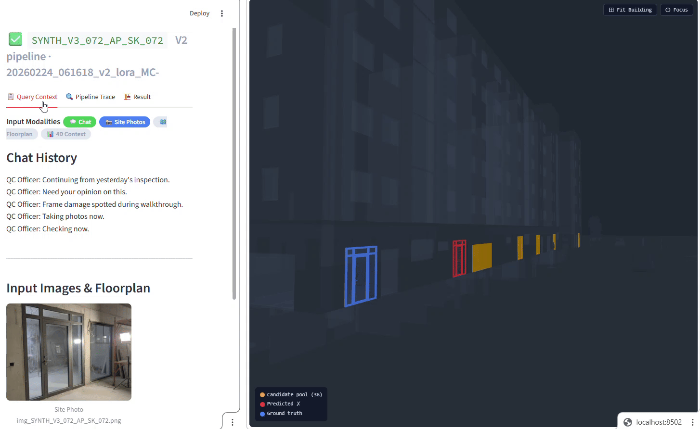

> **Refs:** [38] IFC-Graph (Zhu et al. 2023/2025) · [18] Graph-RAG (Iranmanesh et al. 2025) · [17] LoRA · [35] Multimodal AEC · [34] Hallucination in VLMs (Ye et al.)

## 5. System Architecture Overview

> 🎤 **[~40s]:** Three layers. Input layer: multimodal — chat, site photos, floorplan patch, 4D project metadata. Pipeline layer: V1 is the ReAct agent baseline, V2 is my constraints-driven contribution — both produce the same EvalTrace output contract, so they're directly comparable. Shared backend: IFCEngine with ifcJSON for LLM-friendlier parsing, Neo4j for graph-based retrieval, and optional CLIP reranking. The architectural claim is that combining relation-region crops in the neuro layer with deterministic Cypher in the symbolic layer breaks the attribute entropy bottleneck.

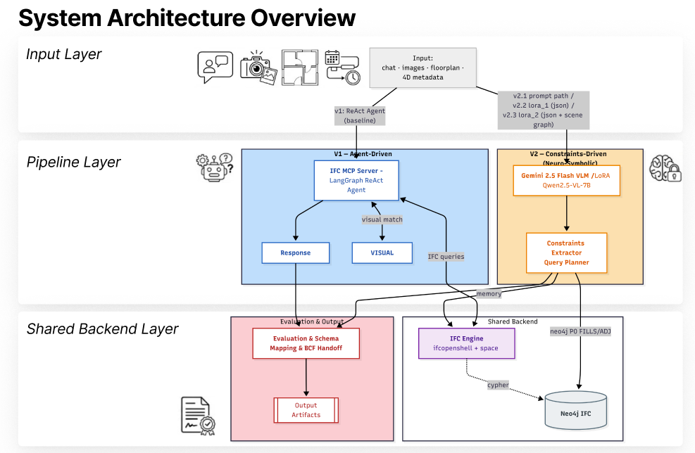

**Three layers:**

1. **Input Layer** — chat history, site photos, floorplan patch, 4D project metadata
   - Interprets and aligns multimodal input

2. **Pipeline Layer** — V1 (ReAct Agent, baseline) or V2 (Constraints-Driven, contribution)
   — both produce the same `EvalTrace` output contract

3. **Shared Backend** — IFCEngine (IfcOpenShell + spatial index), Neo4j graph, CLIP visual aligner
   - **IFCEngine** — IFC parsed to ifcJSON instead of EXPRESS format, improving LLM register performance. *(Fuchs & Borrmann: "A modified ifcJSON-5a\* representation was found to improve performance over traditional EXPRESS formats.")*
   - **Graph database** — IFC semantic relationships stored and queried as a property graph. *(Zhu et al., 2023: "IFC-graph for facilitating building information access and query")*
   - **Graph-RAG** — deterministic Cypher queries replace open-ended LLM retrieval. *(Iranmanesh et al., 2025)*
     1. Schema constraints (correct relationships between entities)
     2. Formatting rules (no meaningful variables in Cypher)
     3. Few-shot examples with correct Cypher queries and responses
    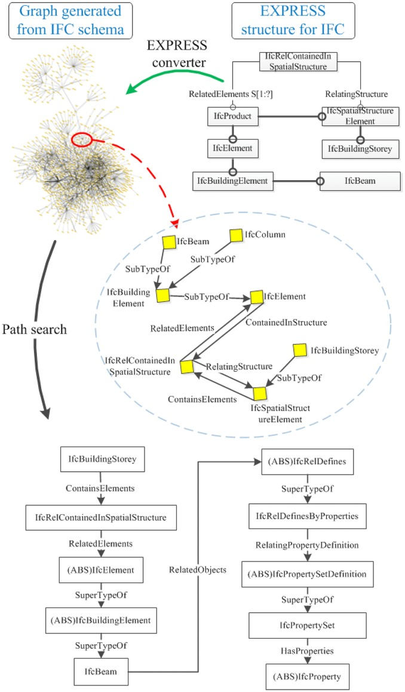

**This system's claim:** Combining (1) Relation-Region Crops for VLM training and (2) deterministic Cypher compilation breaks the attribute entropy bottleneck that vector retrieval and attribute filtering cannot.

> | Zhu et al. 2023/2025 (IFC-Graph) | IFC semantic relationships can be stored and queried as a graph | Motivates Neo4j Symbolic Layer |
> | Iranmanesh et al. 2025 (Graph-RAG) | Graph traversal outperforms vector retrieval in AEC disambiguation | Motivates deterministic Cypher compilation |

## 6. V1 Pipeline: Agent-Driven Baseline

> 🎤 **[~30s]:** V1 is the baseline — and deliberately simple. A LangGraph ReAct agent with Gemini 2.5 Flash calls MCP tools freely: search by type, by storey, match image to elements. It requires zero training and handles edge cases through free-form reasoning. But it's non-deterministic — the same input can give different retrieval paths — it runs at roughly 8 minutes for 84 cases, and it's almost impossible to ablate modality contributions. It tells us the ceiling of what unconstrained agent reasoning achieves.

> note: show latency result — way too slow

**Architecture:** LangGraph ReAct Agent + MCP (Model Context Protocol)

```
Input Case → Gemini 2.5 Flash (ReAct agent)
           → calls MCP tools freely (search_by_type, get_by_storey, match_image)
           → IFCEngine + optional CLIP reranker
           → EvalTrace
```

| Strengths | Weaknesses |
|---|---|
| Flexible, no training required | Non-deterministic — same input can give different retrieval paths |
| Handles edge cases via free-form reasoning | Cannot isolate modality contribution (no controlled ablation) |
| | High latency (~8 min / 84 cases vs ~4 min for V2) |
| | Prompt-sensitive: agent reasoning varies with phrasing |

**Role:** Baseline. V2 fixes interpretability and reproducibility; V2.5 fixes the precision ceiling.

## 7. V2 Pipeline: Constraints-Driven (Current Contribution)

> 🎤 **[~65s]:** V2 is my main contribution. It replaces free-form reasoning with an explicit two-stage pipeline. The neuro layer — currently V2.1 Gemini prompt or V2.2 LoRA — extracts a Pydantic-validated Constraints object: storey name, IFC class, keywords, and spatial relations as structured triplets. That object feeds into a Python query compiler — zero LLM in the loop — that generates deterministic Cypher using an 8-priority cascade. P0 is the new spatial_triplet rule coming in V2.3: match a subject element through a spatial predicate to an anchor. P1 through P7 are attribute-based fallbacks. The symbolic layer executes in Neo4j or the IFC Engine depending on the query type. The critical property: once constraints are extracted, no LLM touches retrieval — so results are reproducible, auditable, and hallucination-free. V2.3 adds the Crop Routing strategy: Object Crop gives the IFC class ID, Relation-Region Crop gives the predicate — this is the spatial topology signal that breaks the attribute entropy bottleneck.

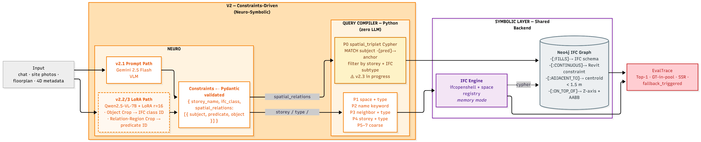

**Architecture:** Neuro-Symbolic, two-stage — balances recall and precision (minimal information loss, zero hallucination):
- **(Neuro)** VLM extracts structured constraints from multimodal input
- **(Symbolic)** Python query compiler maps constraints to deterministic Cypher — zero LLM in the loop

**Methods:**
- Fine-tuned VLM (LoRA on Qwen2.5-VL-7B)
- Spatial triplet → Scene graph *(Wang et al., 2024 — "VLM-based Scene Graph Generation for Industrial Spatial Intelligence")*

  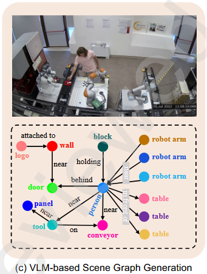

  基于视觉语言模型的场景图生成 (VLM-based Scene Graph Generation — IndVisSGG):
  - 彻底抛弃"先画框/画掩码，再测关系"的繁琐流水线，直接利用 VLMs 的常识推理能力，将图像解析为 `<主语, 谓语, 宾语>` 的空间三元组结构。
  - 无需边界框或像素掩码标注，极大降低数据成本，适合快速迁移到新工业场景。
  - 引入"三元组提取准则 (TEC)"（预定义对象和谓词字典）+ 多智能体协作策略（Multi-agent Strategy）进行交叉审查，有效克服幻觉问题。
  - 方法 (a)(b) 属于"定位驱动"传统范式，依赖昂贵几何标注；方法 (c) 是"语义与推理驱动"新范式，在零目标标注条件下实现更高效、可泛化的场景图生成。
  - 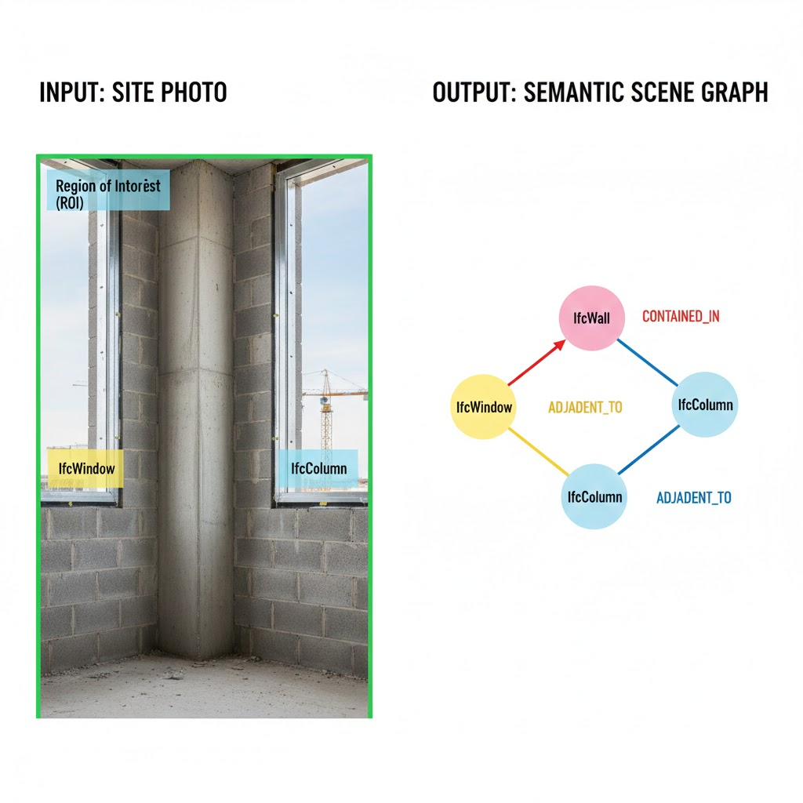

**V2.5 Architecture** *(in progress — LoRA_3 + spatial triplet)*:

```
┌─────────────────────────────────────────────────┐
│  Multimodal Input (same as V2)                  │
└────────────┬────────────────┬────────────────────┘
             │                │
  ┌──────────▼────────────────▼──────────┐
  │   NEURO LAYER — LoRA_3  [PLANNED]   │
  │   Qwen2.5-VL-7B + LoRA r=16        │
  │                                     │
  │   Crop Strategy:                    │
  │   · Object Crop  → IFC class ID     │  ← Wang et al. 2025
  │   · Relation Crop → predicate ID    │  ← THIS WORK
  │                                     │
  │   Output: Constraints (extended)    │
  │   { storey_name, ifc_class,         │
  │     spatial_relations: [            │
  │       {subject, predicate, object}  │
  │     ]}  ← Pydantic validated        │
  └──────────────┬──────────────────────┘
                 │ predicate ∈ {FILLS, CONTINUOUS,
                 │              ADJACENT_TO, ON_TOP_OF}
  ┌──────────────▼──────────────────────┐
  │   QUERY COMPILER — Python [PLANNED] │
  │   Zero LLM / fully deterministic    │
  │   Priority 0: spatial_triplet Cypher│  ← NEW
  │   Priority 1–7: existing cascade    │  ← unchanged fallback
  │   Fallback: ADJACENT_TO → ON_STOREY │
  └──────────────┬──────────────────────┘
                 │ Cypher query
  ┌──────────────▼──────────────────────┐
  │   SYMBOLIC LAYER — Neo4j  [PLANNED] │
  │   -[:FILLS]->       (IFC schema)    │
  │   -[:CONTINUOUS]->  (IFC constraint)│
  │   -[:ADJACENT_TO]-> (centroid<1.5m) │
  │   -[:ON_TOP_OF]->   (Z-axis+AABB)   │
  └─────────────────────────────────────┘
```

## 8. Demo: System in Action

> 🎤 **[~45s]:** Here's the system running. Left panel: case selector and evaluation result. Center: the chat interface with multimodal inputs attached — photo, floorplan patch, 4D context. Right: the 3D BIM viewer — green is the correct prediction, red is wrong. The pipeline trace is what makes V2 interpretable: you can see exactly which priority rule fired, which Cypher was executed, and whether a fallback was triggered. This transparency is impossible in V1. The demo currently supports V2.1 prompt and V2.2 LoRA — V2.3 crop routing is the next stage being wired in.


> note: show working pipeline (input → query plan → results)

**Two current extraction backends:**
- **Prompt-only** (Gemini 2.5 Flash) — zero-shot baseline
- **LoRA_2** (Qwen2.5-VL-7B, r=16) — fine-tuned on 933 multimodal samples

Demo of query → extract → visualise:

| Query Input | Pipeline Trace | Filtered Visualisation | Pipeline Result |
|---|---|---|---|
|  |  |  |  |
| What the system receives | Step-by-step retrieval plan | Candidate filter in 3D view | Retrieved element GUID |

## 9. Dataset Synthetic Pipeline

> 🎤 **[~35s]:** Real site inspection reports are confidential, so I built a fully synthetic data pipeline — no manual labelling required. From raw IFC geometry I generate wireframe renders, photorealistic site photos via Gemini, floorplan patches from IFC coordinates, and augmented chat histories. Three IFC buildings provide diversity: 10-storey office, 2-storey house, split-level duplex. Current version synth_v0.4 gives 933 training samples. synth_v0.5 adds spatial triplet skeletons and relation-region crop renders for V2.3 training.

> note: In order to make a general VLM domain-specific, LoRA fine-tuning is used on Qwen. To fine-tune, a synthetic dataset was generated from 3 raw IFC files.


*Current version (synth_v0.4) — without spatial triplet; spatial triplet will be included in synth_v0.5.*

**Dataset: synth_v0.4 — three IFC buildings:**

| Building | Type | Raw cases | Train (3× aug) | Holdout |
|---|---|---|---|---|
| **AdvancedProject (AP)** | 10-storey office | 250 | 690 | 20 |
| **BasicHouse (BH)** | 2-storey residential | 31 | 33 | 20 |
| **Duplex_A (DXA)** | Split-level duplex | 80 | 210 | 10 |
| **Total** | | 361 | **933** | **50** |

| | | |
|---|---|---|
| 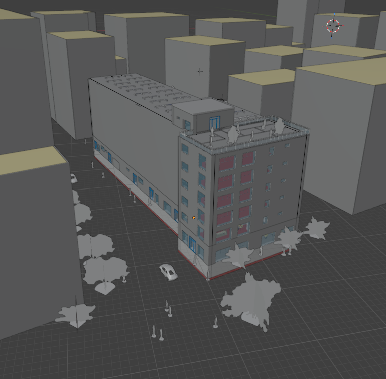 | 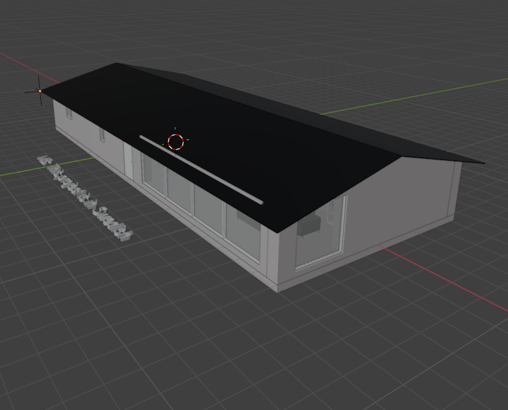 | 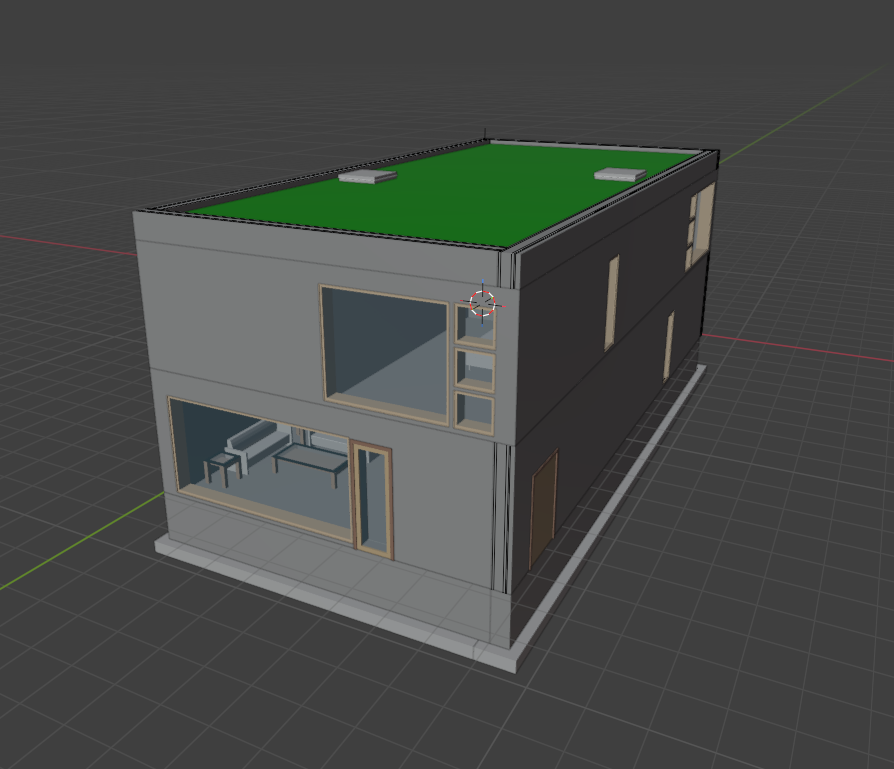 |
| **AdvancedProject (AP)** · *10-storey office* | **BasicHouse (BH)** · *2-storey residential* | **Duplex_A (DXA)** · *Split-level duplex* |

**Generate strategies:** Boundingbox - Relation Crop  → Wireframs → Skeleton-skin Gen AI generation
**Labelling strategies:** Regional Caption, Relation Modelling, Explicit Attribute Modelling

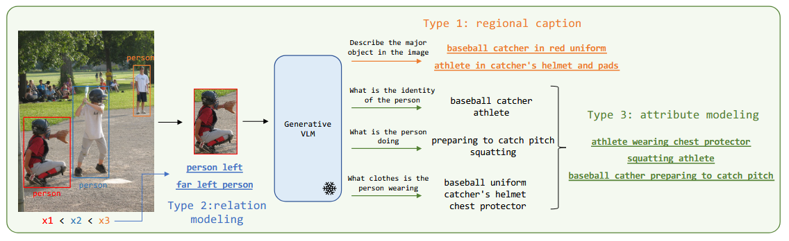

- *(Wang et al., "Learning Visual Grounding from Generative Vision and Language Models", p. 8046)*
- Synthetic image generation from CAD model: human-drawn bounding boxes + model-generated rich descriptions

**Generating visual evidence using CAD model wireframes:**
- *(Valente et al., 2025 — "CAD2DMD-SET: Synthetic Generation Tool of Digital Measurement Device CAD Model Datasets for Fine-Tuning Large Vision-Language Models")*
- Method: produce synthetic data from 3D geometry → augment → plug into fine-tuning pipeline

Current dataset: ~361 raw cases × 3 augmentations → **~933 training samples**


## 10. LoRA vs Prompt — Same Case, Different Outcome

> 🎤 **[~35s]:** Two cases that make the argument concrete. Case 084: LoRA with text only outperforms Prompt with full multimodal input — photos, floorplan, 4D context. The model that was trained on domain-specific data beats the one given more inputs. Case 049: identical inputs, same building, same case — LoRA retrieves the correct GUID, Prompt does not. This demonstrates that fine-tuning on domain-specific structure matters more than feeding more modalities to a general model.

> note: Proof LoRA is working

**Case 084 (AP building — IfcDoor):**

| LoRA_2 (MA — text only) — **CORRECT ✓** | Prompt (MC — text + photos + floorplan) — **WRONG ✗** |
|---|---|
|  |  |

*LoRA correctly identifies the door with text + 4D context only (MA). Prompt fails even with full multimodal input (MC). Predicted element shown in 3D viewer.*

---

**Case 049 (DXA building — IfcDoor, fire door inspection):**

| LoRA_2 (MC — full multimodal) — **CORRECT ✓** | Prompt (MC — same inputs) — **WRONG ✗** |
|---|---|
|  |  |

*Same input modalities, same building, same case — LoRA retrieves the correct GUID, Prompt does not.*

## 11. Evaluation Design: Synthetic Dataset & Modality Ablation

> 🎤 **[~25s]:** The evaluation is a 6-condition modality ablation. MA is text-only, MB adds site photos, MC adds floorplan — each with and without 4D context. 50 holdout cases × 6 conditions × 2 extraction profiles gives 600 traces. The paired design — MA vs MA-minus, MB vs MB-minus, MC vs MC-minus — isolates each modality's contribution independently, controlling for 4D metadata as a confound.

**Metrics:**
> Top-1 accuracy
> SSR (Search Space Reduction) — more suitable to show on a large dataset
> mR@20/100


**Other metrics:**
> Latency, etc.

**To improve / insights:**
> Modality experiment

## 12. Results: Overall Performance (LoRA_2 vs Prompt)

> 🎤 **[~40s]:** LoRA_2 outperforms Prompt across every metric. Top-1 accuracy: 35.3% vs 25.7% — a 9.6 percentage point gain. Valid SSR — where the ground-truth element is retained in the reduced candidate pool — 66.2% vs 52.8%, a 13.4pp gain. Critically, over-reduction drops by 9.6pp — LoRA is far less likely to filter out the correct element entirely. On latency: 0.3 milliseconds pre-computed versus 15 seconds per case for Gemini API calls, at half the cost. LoRA not only improves accuracy — it also makes the system safer by keeping the ground truth in the pool more reliably.


## 13. Detail Results: Synthetic Dataset & Modality Ablation

> 🎤 **[~35s]:** The modality breakdown reveals what's actually contributing. Floorplan adds the most — plus 10 percentage points for LoRA — because spatial layout is a strong geometric anchor for IFC disambiguation. Site photos alone can hurt on complex buildings, likely because the synthetic photo quality isn't yet reliable enough — this points directly to a data quality improvement for synth_v0.5. The 4D metadata contributes consistently but modestly. Across buildings: AP is near the attribute entropy floor at 8% Top-1, which is the 1-in-46 baseline. BasicHouse and Duplex_A show much stronger gains from photos and floorplan respectively, because those buildings have lower element density.

> note: In order to prove the photo is contributing signal, and to prevent 4D metadata (semi-structured data) from masking results, modality masks were applied to each condition.

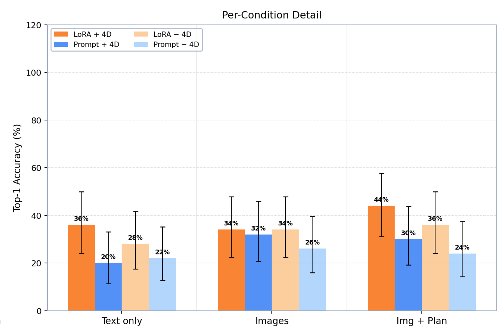
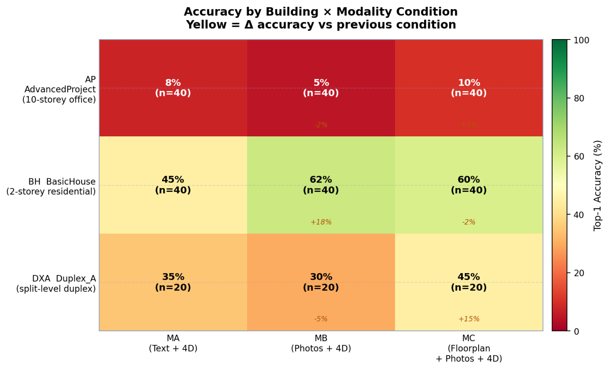

## 14. Key Insights & Failure Analysis

> 🎤 **[~40s]:** Three engineering lessons from failure analysis. First: the attribute entropy bottleneck is real and severe — when a floor has 46 identical windows, attribute filtering and CLIP similarity both peak at 2.2%. The elements are mathematically identical in isolation; only spatial topology distinguishes them. This is the core motivation for V2.3. Second: wrong storey extraction causes catastrophic filter failure — one bad field eliminates the ground truth entirely. Storey is the highest-leverage single attribute. Third: the two-step predicate relaxation in the symbolic layer catches these failures gracefully — the H2 hard-negative eval set shows 100% GT-in-pool across 83 cases with zero fabricated GUIDs. That 100% figure is the evidence base for why the symbolic layer is necessary, not optional.

## 15. Progress Summary & Next Steps / Timeline

> 🎤 **[~25s]:** To summarise the state of work: theory foundation, V1 agent, V2.1 prompt and V2.2 LoRA with results, and 933-sample dataset are all done. Chapters 1 through 4 are complete. From now through mid-March: complete the spatial triplet dataset for synth_v0.5, run V2.3 experiments, and invite industry practitioners for feedback on the demo. Late March: finish remaining thesis writing. April: this mid-presentation. Thank you.

> To Contribute:
(1) Thesis writing,
(2) Synthetic Dataset,
(3) Prototype (LoRA fine-tune model, constraints rules algorithm and system design)


**Done:**
- Theory Foundation
- V1 Agent, V2.1 Prompt, V2.2 LoRA → with results
- Synthetic Dataset ~933 samples

**26 Feb to first half of Mar:**
- Complete spatial triplet for synthetic dataset,
- complete V2.5 with experiment results;
- invite industry people for feedback, refine demo, collect feedback.

**Second half of Mar:** Complete remaining thesis writing.

**Apr:** Mid-presentation, etc.

---

**Thesis writing progress:**

| Chapter | Status |
|---|---|
| Chap 1 | ✅ |
| Chap 2 | ✅ |
| Chap 3 | ✅ *(unless further changes)* |
| Chap 4 | ✅ *(unless further changes)* |
| Chap 5 | Framework in place |
| Chap 6 | — |
| Chap 7 | — |
